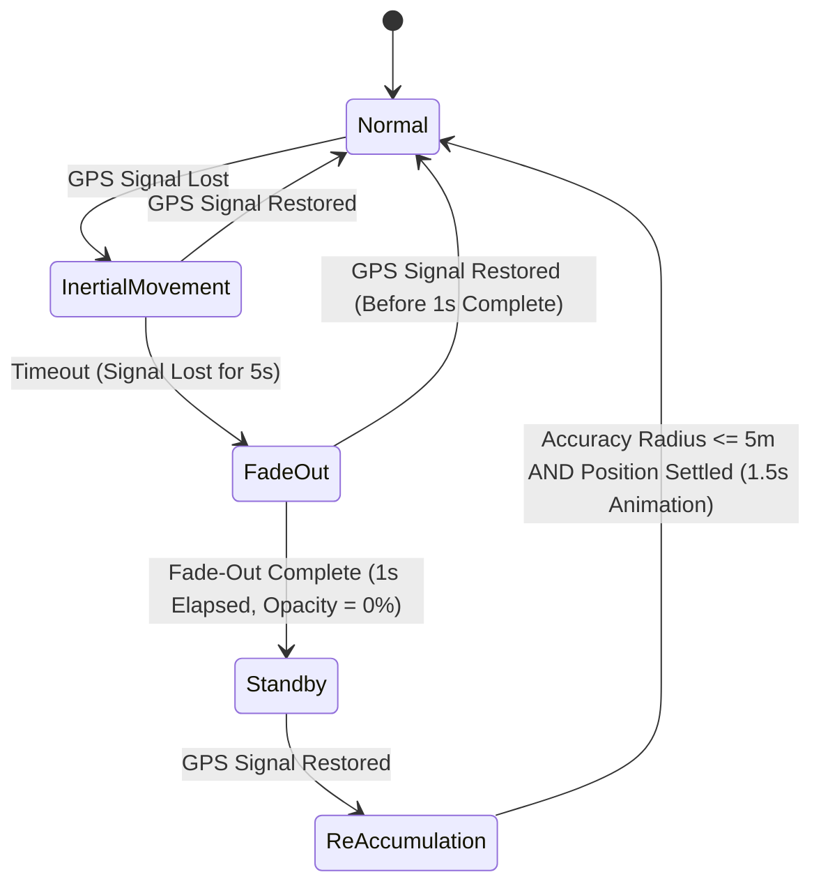

# AGENTS.md — 技術仕様と作業規約

数式・FSM・レイテンシ予算・検証ワークフロー・実装不変条件の**単一の一次情報**。
ソースコードのコメントが `AGENTS.md §3 / §4.1 / §4.2 / §5` を参照しているため、**節番号は変えない**。

## 1. 関連ドキュメント

- 機能→実装→検証の対応表: [HANDOVER.md](HANDOVER.md)
- Swift⇄Unity のメッセージ契約: [SWIFT_INTEGRATION.md](SWIFT_INTEGRATION.md)
- 第1期スコープ・機能ID(F-01〜F-11)・仕様値: [CLAUDE.md](CLAUDE.md)

## 2. Component Roles

1. **iPhone (Core Engine)**: 空間処理・センサー融合・状態管理・描画命令生成。
2. **AR Glass (Visual Output)**: XREAL One / Eye。アバターとHUDを投影(USB-C有線・DisplayPort Alt Mode)。
3. **Apple Watch (Biometric Sensing)**: 心拍・ピッチ。**第1期スコープ外**(実装は残っているが検証・優先度の対象外)。

- **Swift** (`ios/`): UI/UX・デバイス接続・ARKit/CoreLocation のライフサイクル。Unityをライブラリ(UaaL)として内包する。
- **C# / Unity** (本リポジトリ): 空間エンジン・カルマンフィルタ(`SpatialKalmanFilter`)・FSM・描画。
  旧C++版カルマンフィルタは 2026-09-11 に廃止し、エディタと実機で同じC#実装を使う。

---

## 3. Motion-to-Photon Latency & Timing Budget

酔い防止と同期維持のため、**Motion-to-Photon ≤ 20ms**(最大許容30ms)を守る。

### Latency Allocation Breakdowns
- **IMU Data Acquisition (USB-C)**: ≤ 2ms
- **Kalman Filter Sensor Fusion (C#)**: ≤ 4ms
- **AR Frame Command Generation (Metal/ARKit)**: ≤ 6ms
- **USB-C Frame Transmission to Glass**: ≤ 8ms
- **Total Pipeline Target**: **≤ 20ms**

### Core Sampling and Rendering Constraints
- **IMU Sampling Rate**: ≥ 100Hz。
- **HUD Frame Rate**: 60fps(16.6ms/frame)。
- **Jitter Tolerance**: フレーム間隔の変動は ±5ms 以内。超えたフレームは生の測定値を捨て、
  カルマンフィルタ(`SpatialKalmanFilter`)の予測補間を優先する。

---

## 4. Core Mathematical Formulae & Geometric Domain Logic

### 4.1 Avatar Position Calculation (Vector_Forward Purification)
頭や視線の瞬間的な動きでアバターが左右に揺れる(=酔う)のを防ぐため、進行方向はグラスのコンパスではなく
iPhoneの移動ベクトルの移動平均から求める。

```
P_avatar = P_user + 3.0 × V_forward
```

- `V_forward` は直近 **1.5秒** のGPS移動ベクトル(+IMU)を積算。指数重み付き移動平均(新しいほど重い):
  `w_i = e^(-2.5 × age_i)`、`V_forward = Σ(w_i × d_i) / Σ(w_i)`
- **Gaze Lock**: GPS移動が微小(< 0.02m)の間は方向を保持する。視線(`userCamera.forward`)は使わない。
- 旋回は最大 **45°/s**(`Quaternion.RotateTowards`)。

### 4.2 Ground Snap & Vertical Smoothing (LiDAR Enhanced)
- **Vertical Threshold**: 接地面の高さ変化が ±15cm を超えたら即スナップせず、**0.3秒**かけて補間
  (`Mathf.SmoothDamp`)。垂直レイは `Physics.RaycastAll(origin, down, 20m)`。
- **Cliff/Obstacle Exception**: 前方 **3.0m** 以内に高さ **1.5m** 以上の崖・壁を検知したら
  (`Physics.SphereCastAll`, 半径0.4m)前進を止め、ユーザーと向き合う「その場ジョグ」で待つ。

### 4.3 Analytics & Environmental Models
- **Synchronicity Rate (S)**: `S = 100 × (1 − d/10)`(d = 目標ペースとの累積距離偏差、d ≥ 10m で 0%)。
  1km / 5km 単位で集計し、走行終了時に平均同期率 90 / 80 / 65 / 50% を閾値として **S〜D** の評価を出す。
- **Fatigue Correction Coefficient (C_f)**: 気温 T < 28°C → 1.0 / 28 ≤ T < 31°C → 1.5 / T ≥ 31°C → 2.0。
  `Fatigue += (100 − S) × 0.01 × Δt × C_f`

### 4.4 その他の実装式
- **ペース→速度**: `v = 1000 / (P × 60)` m/s(P = 分/km。5:00/km → 3.33 m/s)。`PaceSynchronicityMath.PaceToMetersPerSecond`
- **エラスティックバンド**: ユーザーが遅れると 0.5× まで減速、接近で 1.2×、スプリント追い抜き 1.25×。
- **カルマンフィルタ**(各軸独立、`SpatialKalmanFilter`): 予測 `x' = x + v·dt`(dt は 0.5s で頭打ち)、
  `p += Q·dt`、`g = p/(p+R)`、`x = x' + g(z − x')`、`p *= (1−g)`。既定 Q=3.0/s, R=0.80。
  **時間(dt)基準**であり、フレーム数基準に戻さないこと(30fpsと60fpsで挙動が変わる)。
- **ルート逸脱**(Cross-Track Error): `t = clamp(dot(AP,AB)/|AB|², 0, 1)`、`d = |P − (A + t·AB)|`。d ≥ 5m でサイレントリカバリー。
- **TTC**: `TTC = d_obstacle / v_closing`、≤ 1.5s で警告。実装の `SafetyAndSystemController` は**未配線**(CLAUDE.md「未決事項」)。
- **バイオルミネッセンス**(第1期スコープ外): `intensity = base + sin(t × (HR/60)·π) × amplitude`。

---

## 5. State Machine Lifecycle (GPS Fault Tolerance)

GPSロストと再測位を扱うFSM。実装は `GameStateController`、ロスト判定の入力は `GpsSignalMonitor`
(更新1.5秒途絶 or 水平精度10m超でロスト、精度5m以内で復帰)。



- `TransitionToState(Reaccumulation)` は `SimulatedGPSAccuracyRadius` を 99 に戻す。精度を設定するのは**遷移の後**。

---

## 6. Working Agreements

### 変更時の検証ワークフロー
順に実行し、**全ステップ成功**(4 は終了コード0)で完了とする。

1. **C#コンパイル**(Unityを開かない): Unityが生成するルートの `Assembly-CSharp*.csproj` は gitignore 対象で古いことがある。
   代わりに scratch に SDK形式の csproj を作る — `netstandard2.1` / `LangVersion 9`、
   `Assets/_Project/Scripts/**/*.cs` を glob、参照は `Library/ScriptAssemblies/*.dll`(`Assembly-CSharp*` を除く)と
   `C:\Program Files\Unity\Hub\Editor\6000.3.17f1\Editor\Data\Managed\UnityEngine\*.dll`。
   **`UnityEditor.dll` は足さない**(`UnityEngine` フォルダの `UnityEditor.CoreModule` と型が重複する)。その上で `dotnet build`。
2. **ユニットテスト**: `cd Tests/UnitTests && dotnet test`(Unity非依存・数秒)。
   純ロジックは `PaceMath` のような依存ゼロの静的クラスへ書き、MonoBehaviour は委譲する — そうすればここでテストできる。
3. **Swift構文**(Swiftを触ったとき): `"$LOCALAPPDATA/Programs/Swift/Toolchains/6.3.3+Asserts/usr/bin/swiftc.exe" -parse <file>`。
   型検査はMacでのみ可能。
4. **E2E回帰**: `"C:\Program Files\Unity\Hub\Editor\6000.3.17f1\Editor\Unity.exe" -batchmode -projectPath <repo> -executeMethod E2EScenarioRunner.Run -logFile e2e.log`
   → 終了コード0(2〜3分)。失敗時は `e2e.log` の `[E2E]` 行を読む。エディタでプロジェクトを開いていると即失敗する。
   シナリオ追加は `E2EScenarioBehaviour.cs`。
5. **記録**: [CHANGELOG.md](CHANGELOG.md) の先頭へ5行以内のエントリを追加(変更・理由・検証結果)。

### 実装上の不変条件(破ると壊れる)
- **`AvatarEngine.IsHalted` は `GroundSnap` が毎フレーム上書きする**。恒久的な停止には `IsSessionEnded` を使う
- **距離の単一ソース原則**: Swift主導中(`ARSessionManagerBridge.ExternalMetricsActive`)はUnity内部計測をスプリット判定へ流さない。記録・ゴール判定は `RunSessionController.AuthoritativeDistanceMeters`(新鮮なGPS優先・5秒でUnity計測へフォールバック)を共用
- **アバターは常時「ユーザー+3m」アンカー追従**(自走ではない)。10m離隔待機は「アバター停止中にユーザーが離れる」場合にのみ発生する
- **Animator取得は `AvatarRigLocator.FindBestAnimator`** — コンテナに無効化された旧Animatorが残っており、素の `GetComponentInChildren<Animator>` はそれを拾う
- **AnimatorControllerはジェネレータ管理**(`AvatarAnimatorControllerGenerator`)。手編集せず再生成する(同一パスならGUID維持でシーン参照は無傷)
- **UnitySendMessage対象のGameObject名は固定**: "ARSessionManager" / "DeviceManager"(Bootstrapが自動生成)
- **他コンポーネントの状態は型安全な公開APIで触る**(例: `AvatarEngine.ResyncPacingAnchor`)。リフレクション(`field?.SetValue`)は名前変更時に無言で失敗するため使わない
- **平滑化はフレーム時間依存にする**(`FrameSmoothing`)。長いフレームで追従が瞬間移動に化けないため
- **モデル(Animatorの付いた子)の `localPosition` は `FootPlanting` が毎フレーム書く**(足のめり込み補正)。位置を変えたいときはルートを動かす。足裏の点はメッシュから取るので、アバターのFBXは **Read/Write 有効**にする(無効だと骨からの概算に落ちる)
- 新規マネージャーは `ARVisionSystemsBootstrap` に登録すればシーン配線不要

### ペース単位の規約
Swift⇄ブリッジ境界は km/h、Unity内部は 分/km(変換: 分/km = 60 ÷ km/h)。
設定データ `targetPaceMinutesPerKm` は名前に反して**秒**で保持する(例 270 = 4分30秒)。
