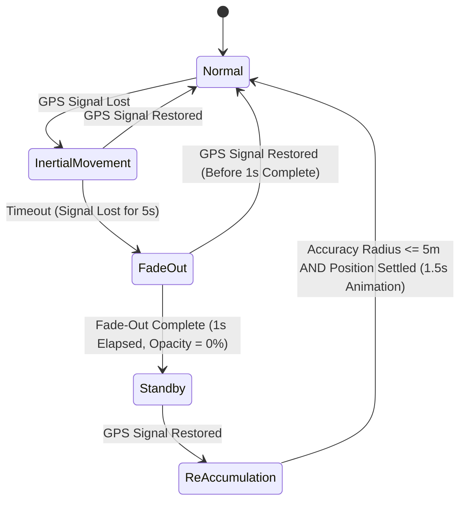

# AGENTS.md — AR Vision (AR Pacesetter) 共通エージェント指針

**すべてのAIエージェント(Claude Code / Codex / Cursor / GitHub Copilot / Gemini CLI 等)と開発者が従う単一の一次情報。**
ツール別の指示ファイル(`CLAUDE.md` / `.github/copilot-instructions.md` / `GEMINI.md`)はこのファイルを指すだけ。
ルールを変えるときは**ここだけを直す**。仕組みの説明は [Docs/AI_AGENTS.md](Docs/AI_AGENTS.md)。

ソースコードのコメントが `AGENTS.md §3 / §4.1 / §4.2 / §5` を参照しているため、**節番号は変えない**。

ARランニング支援システム。3.0m前方を走る半透明アバターとの「距離感」でペーシングする。
Unityプロジェクト(本リポジトリのルート)+ SwiftUIホスト(`ios/`)の Unity as a Library モノレポ。

## 1. 読み方

### 仕様の優先順位
1. **Aチーム基本設計書 v1**(2025/06/09 梁・PDF、要点は本ファイル §2 に転記)— 第1期の正式仕様
2. 本ファイル — 数式・FSM・レイテンシ予算・検証ワークフロー・実装の約束
3. [HANDOVER.md](HANDOVER.md) — 機能→実装→検証の対応表と未完了事項(§5)

### いつ何を読むか
- コードを変更する前 → §6(検証ワークフローと実装の約束)
- アバター位置・接地・カルマンフィルタ・同期率に触れる → §4
- GPSロスト/FSM(`GameStateController` / `GpsSignalMonitor`)に触れる → §5
- Swift⇄Unity のメッセージを追加・変更する → [SWIFT_INTEGRATION.md](SWIFT_INTEGRATION.md)
- グラス表示・画角・頭部姿勢 → [Docs/XREAL_ONE_INTEGRATION.md](Docs/XREAL_ONE_INTEGRATION.md)
- 屋外路面の分類(ARCore) → [Docs/ARCORE_SCENE_SEMANTICS.md](Docs/ARCORE_SCENE_SEMANTICS.md)
- 差し替えアバター(VRM) → [Docs/VRM_AVATARS.md](Docs/VRM_AVATARS.md)
- 実地テストの計画 → [Docs/FIELD_TEST_PLAN.md](Docs/FIELD_TEST_PLAN.md)
- iOSビルド(Mac) → [SWIFT_INTEGRATION.md](SWIFT_INTEGRATION.md) ② / [Docs/BUILD_ON_BORROWED_MAC.md](Docs/BUILD_ON_BORROWED_MAC.md)
- 過去の経緯(なぜそうなっているか) → [CHANGELOG.md](CHANGELOG.md) を検索する(全文は長いので読み通さない)

---

## 2. スコープ・構成・仕様値

### 第1期検証フェーズのスコープ(基本設計書 §1.2)
**iPhone単体 + ARグラス(USB-C有線)の2台構成**。Apple Watch・外部サーバー・バイタルセンサーは
意図的にスコープ外 — 通信ボトルネックを排し M2P 20ms を守るため。
ゴールは「陸上トラックにおけるARペーシング技術の完全確立」。技術限界データのCSV蓄積がソラド社への譲渡基盤になる。

Watch/HealthKit/ゴースト等の企画書由来機能も実装済み。削除はせず、触るときは影響を最小に留める。
検証・デモ・実装の優先度は F-01〜F-11 が先。

### Component Roles
1. **iPhone (Core Engine)**: 空間処理・センサー融合・状態管理・描画命令生成。
2. **AR Glass (Visual Output)**: XREAL One / Eye。アバターとHUDを投影(USB-C有線・DisplayPort Alt Mode)。
3. **Apple Watch (Biometric Sensing)**: 心拍・ピッチ。**第1期スコープ外**。

- **Swift** (`ios/`): UI/UX・デバイス接続・ARKit/CoreLocation のライフサイクル。Unityをライブラリとして内包する。
- **C# / Unity** (`Assets/_Project/Scripts/`): 空間エンジン・カルマンフィルタ(`SpatialKalmanFilter`)・FSM・描画。
  旧C++版カルマンフィルタは 2026-09-11 に廃止し、エディタと実機で同じC#実装を使う。

### 機能一覧(F-01〜F-11)

| ID | 機能 | 要点 |
|---|---|---|
| F-01 | 走行条件設定 | 目標ペース・トラック距離(400m等)の入力・保持 |
| F-02 | レディチェック | グラス接続+GPS測位精度の確認、全緑で走行開始活性化 |
| F-03 | 3.0m前方維持 | 進行方向3.0m前方へ配置・追従 |
| F-04 | 曲線部接線維持 | コーナーで向きを接線方向へ100%一致(前後フレーム座標から逆算) |
| F-05 | グラウンドスナップ | LiDAR/空間認識で接地。異常値(断崖等)は前フレーム高さを維持 |
| F-06 | アニメーション制御 | Idle(0)/Walk(0.1〜5.0km/h・再生速度同期)/Run(5.0km/h+)のブレンド |
| F-07 | 周辺視野レイアウト | 左上=時間・距離 / 右上=現在ペース(遅れ=赤・維持=緑) / 中央=完全透過(アバターのみ) / 下部=警告時のみ |
| F-08 | 視覚的安定化 | 1.5秒移動平均(IMU 150フレーム)で首振りブレを排除 |
| F-09 | GPSロスト慣性移動 | 判定: 更新1.5秒途絶 or 水平精度10m超。直前1秒の平均速度・方向で最大5秒慣性。復帰時は1秒かけて同期 |
| F-10 | フェードアウト | ロスト5秒継続で1秒(60f)かけてα100→0%。HUD下部に赤字警告「GPS信号を探索中：安全のため減速してください」 |
| F-11 | リアルタイムログ保存 | 位置・IMU・描画遅延をローカルCSVへ100Hz出力(下記) |

### 主要仕様値
- **アバター色(§7.1)**: ジャスト(目標リード±1.5m)=緑 / 遅延(3.0m以上離れ)=橙→赤グラデ / 超過(追い抜き)=青。`AvatarPaceColor`
- **オーラ(§7.2)**: 5.0m以上遅れで足元からランナー側へ光のライン。`AvatarAuraEffect`
- **非機能(§10)**: M2P 20ms以内(最大許容30ms) / 位置誤差1.0m以内・接地誤差上下5cm以内 / 連続稼働60分(バッテリー30%以上)
- **描画**: 60fps。映像はDisplayPort Alt Mode(USB-C有線・無圧縮1080p)、グラスはバスパワー給電
- **グラス切断時(§8.3)**: CSVログはBGで継続しスタンバイへ。再接続だけではアバターを出さず、準備画面からの再スタート(`ResumeSession`)で復帰
- **設定データ(§5.1)**: `targetPaceMinutesPerKm`(**秒**で保持、例270=4分30秒)・`trackLength`(m)・`avatarDistance`(3.0)・`isGlassConnected`・`gpsAccuracyStatus`(0=圏外/1=低/2=高)
- **走行ログCSV(§5.2)**: `<persistentDataPath>/RunLogs/Log_YYYYMMDD_HHMMSS.csv`、100Hz、列=`timestamp, gps_latitude, gps_longitude, imu_accel_x/y/z, avatar_pos_x, avatar_pos_z, latency_m2p`。`RunTelemetryLogger`
- **開発環境(§11)**: Unity 6000.3.17f1 / C#+Swift / iOS 26+ / iPhone 12 Pro以上
- **テスト3フェーズ(§11.2)**: ①室内ベンチ(100Hz+CSV確認) → ②歩行・低速(3m追従・ワープなし) → ③400mトラック実証(旋回・HUD・フェードアウト+CSVで20ms評価)

---

## 3. Motion-to-Photon Latency & Timing Budget

酔い防止と同期維持のため、**Motion-to-Photon ≤ 20ms**(最大許容30ms)を守る。

### Latency Allocation Breakdowns
- **IMU Data Acquisition (USB-C)**: ≤ 2ms
- **Kalman Filter Sensor Fusion (C#)**: ≤ 4ms
- **AR Frame Command Generation (Metal/ARKit)**: ≤ 6ms
- **USB-C Frame Transmission to Glass**: ≤ 8ms
- **Total Pipeline Target**: **≤ 20ms**

### Core Sampling and Rendering Constraints
- **IMU Sampling Rate**: ≥ 100Hz。
- **HUD Frame Rate**: 60fps(16.6ms/frame)。
- **Jitter Tolerance**: フレーム間隔の変動は ±5ms 以内。超えたフレームは生の測定値を捨て、
  カルマンフィルタ(`SpatialKalmanFilter`)の予測補間を優先する。

---

## 4. Core Mathematical Formulae & Geometric Domain Logic

### 4.1 Avatar Position Calculation (Vector_Forward Purification)
頭や視線の瞬間的な動きでアバターが左右に揺れる(=酔う)のを防ぐため、進行方向はグラスのコンパスではなく
iPhoneの移動ベクトルの移動平均から求める。

```
P_avatar = P_user + 3.0 × V_forward
```

- `V_forward` は直近 **1.5秒** のGPS移動ベクトル(+IMU)を積算。指数重み付き移動平均(新しいほど重い):
  `w_i = e^(-2.5 × age_i)`、`V_forward = Σ(w_i × d_i) / Σ(w_i)`
- **Gaze Lock**: GPS移動が微小(< 0.02m)の間は方向を保持する。視線(`userCamera.forward`)は使わない。
- 旋回は最大 **45°/s**(`Quaternion.RotateTowards`)。

### 4.2 Ground Snap & Vertical Smoothing (LiDAR Enhanced)
- **Vertical Threshold**: 接地面の高さ変化が ±15cm を超えたら即スナップせず、**0.3秒**かけて補間
  (`Mathf.SmoothDamp`)。垂直レイは `Physics.RaycastAll(origin, down, 20m)`。
- **Cliff/Obstacle Exception**: 前方 **3.0m** 以内に高さ **1.5m** 以上の崖・壁を検知したら
  (`Physics.SphereCastAll`, 半径0.4m)前進を止め、ユーザーと向き合う「その場ジョグ」で待つ。
- **足のめり込み補正**: GroundSnap はアバターの原点を床に合わせ、`FootPlanting` が立脚期の足裏を床へ合わせる(§6)。

### 4.3 Analytics & Environmental Models
- **Synchronicity Rate (S)**: `S = 100 × (1 − d/10)`(d = 目標ペースとの累積距離偏差、d ≥ 10m で 0%)。
  1km / 5km 単位で集計し、走行終了時に平均同期率 90 / 80 / 65 / 50% を閾値として **S〜D** の評価を出す。
- **Fatigue Correction Coefficient (C_f)**: 気温 T < 28°C → 1.0 / 28 ≤ T < 31°C → 1.5 / T ≥ 31°C → 2.0。
  `Fatigue += (100 − S) × 0.01 × Δt × C_f`

### 4.4 その他の実装式
- **ペース→速度**: `v = 1000 / (P × 60)` m/s(P = 分/km。5:00/km → 3.33 m/s)。`PaceSynchronicityMath.PaceToMetersPerSecond`
- **エラスティックバンド**: ユーザーが遅れると 0.5× まで減速、接近で 1.2×、スプリント追い抜き 1.25×。
- **カルマンフィルタ**(各軸独立、`SpatialKalmanFilter`): 予測 `x' = x + v·dt`(dt は 0.5s で頭打ち)、
  `p += Q·dt`、`g = p/(p+R)`、`x = x' + g(z − x')`、`p *= (1−g)`。既定 Q=3.0/s, R=0.80。
  **時間(dt)基準**であり、フレーム数基準に戻さないこと(30fpsと60fpsで挙動が変わる)。
- **ルート逸脱**(Cross-Track Error): `t = clamp(dot(AP,AB)/|AB|², 0, 1)`、`d = |P − (A + t·AB)|`。d ≥ 5m でサイレントリカバリー。
- **TTC**: `TTC = d_obstacle / v_closing`、≤ 1.5s で警告。実装の `SafetyAndSystemController` は**未配線**(§7)。
- **バイオルミネッセンス**(第1期スコープ外): `intensity = base + sin(t × (HR/60)·π) × amplitude`。

---

## 5. State Machine Lifecycle (GPS Fault Tolerance)

GPSロストと再測位を扱うFSM。実装は `GameStateController`、ロスト判定の入力は `GpsSignalMonitor`
(更新1.5秒途絶 or 水平精度10m超でロスト、精度5m以内で復帰)。



- `TransitionToState(Reaccumulation)` は `SimulatedGPSAccuracyRadius` を 99 に戻す。精度を設定するのは**遷移の後**。

---

## 6. Working Agreements

### 変更時の検証ワークフロー
**`tools/verify.sh` を実行し、終了コード0(`ALL CHECKS PASSED`)で完了とする。** Windows(Git Bash)と macOS で共通。
途中で失敗すればそこで止まる。E2E を省く `--fast`(数十秒)は途中確認用で、完了判定には使わない。

| # | ステップ | 個別コマンド | 備考 |
|---|---|---|---|
| 1 | C#コンパイル | `dotnet build tools/compile-check` | Unityを開かずに `Assets/_Project/Scripts` を検証。要: Unity 6000.3.17f1 と一度生成済みの `Library/` |
| 2 | ユニットテスト | `dotnet test Tests/UnitTests` | Unity非依存・数秒。PRでもCIが自動実行する |
| 3 | Swift構文 | `swiftc -parse <file>` | 構文のみ。型検査はMacのXcodeでのみ可能 |
| 4 | E2E回帰 | Unity を `-batchmode -projectPath <repo> -executeMethod E2EScenarioRunner.Run -logFile e2e.log` | 2〜10分。**Unityエディタでプロジェクトを開いていると即失敗する**。失敗時は `e2e.log` の `[E2E] FAIL` 行を読む |

- Unityやswiftcが既定の場所に無い場合は `UNITY_PATH=...` / `SWIFTC=...` を付けて `tools/verify.sh` を実行する。
- E2Eのシナリオ追加は `Assets/_Project/Scripts/E2EScenarioBehaviour.cs`。アニメーションする値は1フレームで測らない(歩幅の位相で合否が変わる)。
- 純ロジックは `PaceMath` のような依存ゼロの静的クラスへ書き、MonoBehaviour は委譲する — そうすれば `Tests/UnitTests` でテストできる
  (テスト対象ファイルは `ARVision.UnitTests.csproj` の `<Compile Include>` に足す)。

### コミットの規約
- コミット前に [CHANGELOG.md](CHANGELOG.md) の先頭へ**5行以内**のエントリを足す(変更・理由・検証結果)。
- コミットメッセージは**日本語**で、検証結果(例: `dotnet test 340/340、E2E 209/209`)を書く。

### 実装の約束(破ると壊れる)
- **`AvatarEngine.IsHalted` は `GroundSnap` が毎フレーム上書きする**。恒久的な停止には `IsSessionEnded` を使う
- **距離の単一ソース原則**: Swift主導中(`ARSessionManagerBridge.ExternalMetricsActive`)はUnity内部計測をスプリット判定へ流さない。記録・ゴール判定は `RunSessionController.AuthoritativeDistanceMeters`(新鮮なGPS優先・5秒でUnity計測へフォールバック)を共用
- **アバターは常時「ユーザー+3m」アンカー追従**(自走ではない)。10m離隔待機は「アバター停止中にユーザーが離れる」場合にのみ発生する
- **Animator取得は `AvatarRigLocator.FindBestAnimator`** — コンテナに無効化された旧Animatorが残っており、素の `GetComponentInChildren<Animator>` はそれを拾う
- **AnimatorControllerはジェネレータ管理**(`AvatarAnimatorControllerGenerator`)。手編集せず再生成する(同一パスならGUID維持でシーン参照は無傷)。閾値は km/h 基準を m/s に換算した値(Walk 0.0278 / Run 1.3889 / Sprint 4.1667)
- **UnitySendMessage対象のGameObject名は固定**: "ARSessionManager" / "DeviceManager"(Bootstrapが自動生成)
- **他コンポーネントの状態は型安全な公開APIで触る**(例: `AvatarEngine.ResyncPacingAnchor`)。リフレクション(`field?.SetValue`)は名前変更時に無言で失敗するため使わない
- **平滑化はフレーム時間依存にする**(`FrameSmoothing.Factor(Time.deltaTime, k)`)。`Lerp(a, b, Time.deltaTime * k)` は長いフレームで瞬間移動に化ける
- **モデル(Animatorの付いた子)の `localPosition` は `FootPlanting` が毎フレーム書く**(足のめり込み補正)。位置を変えたいときはルートを動かす。足裏の点はメッシュから取るので、アバターのFBXは **Read/Write 有効**にする
- 新規マネージャーは `ARVisionSystemsBootstrap` に登録すればシーン配線不要
- アバターの色は発光で出すので、アバターのmaterialは **Emission 対応**にする
- GPSロスト判定を止めたいときは実行時コマンド `SetGpsLostHandling {enabled}` を使う。既定値(`true`)は仕様どおりに保つ。
  屋内で消えないのは `GpsSignalMonitor.RequireInitialFixBeforeLost` のおかげ(良好な初回測位前はロスト判定しない)
- 実測GPSサンプルが来ない間 `GpsSignalMonitor` は介入しない — エディタの G/R/A キー検証はこれに依存する
- IMU加速度の供給元は `RunTelemetryLogger.ImuSource` で判別する(実機=`Input.gyro.userAcceleration`、エディタ=カメラ差分近似)。`SetImuAcceleration` はC#専用で、Swiftからは呼べない
- グラスの画面モードは **Follow(固定)**。Anchor だと頭部補正が二重にかかる。iOSからグラスの頭部姿勢は取得できない
- 屋外路面分類(ARCore)は `#if ARCORE_EXTENSIONS` の中だけで触る。**3D面分類を画像分類で上書きしない**
- VRMアバターの受け入れ基準(三角形70,000・マテリアル8等)は 60fps と M2P 20ms のための値。`.vrca`(VRChat)は使えない
- `tools/prepare-free-signing.sh` の実行結果(Bundle ID・署名設定の一時改変)はコミットしない。CIが検知して落とす

### ペース単位の規約
Swift⇄ブリッジ境界は km/h、Unity内部は 分/km(変換: 分/km = 60 ÷ km/h)。
設定データ `targetPaceMinutesPerKm` は名前に反して**秒**で保持する(例 270 = 4分30秒)。

---

## 7. 未決事項(チーム判断待ち — エージェントは独断で解決しない)

1. **3.0m前方と画角の両立(F-03 × グラス)**: 身長1.75mのアバターは3.0mで垂直31.1°を占め、グラスの垂直25.7°に全身が入らない
   (全身には3.7m必要)。§7.2のオーラ(足元)も視野外。距離か見え方か、どちらを譲るかはチームが決める
2. **`SafetyAndSystemController`(TTC警告・低バッテリー退避)は休眠中**: 実行時に生成されない。有効化には
   (a)障害物検知ソースの接続 (b)非検出時にTTCを `ttcScanRange` で計算する誤りの修正が要る —
   そのまま配線すると19.2km/h超で誤警報が出る。詳細は HANDOVER.md §5
