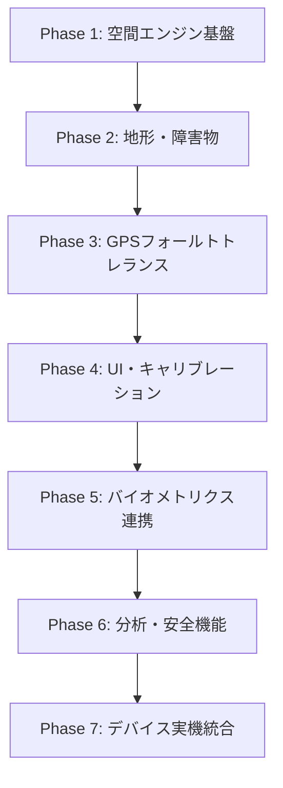
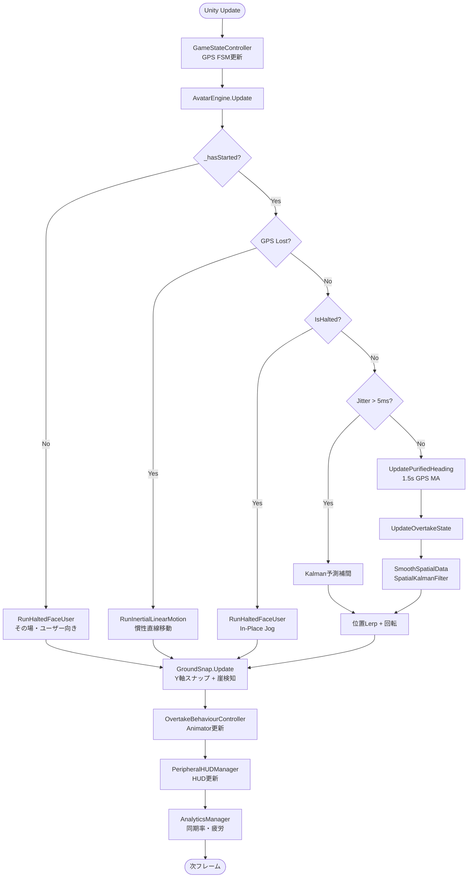
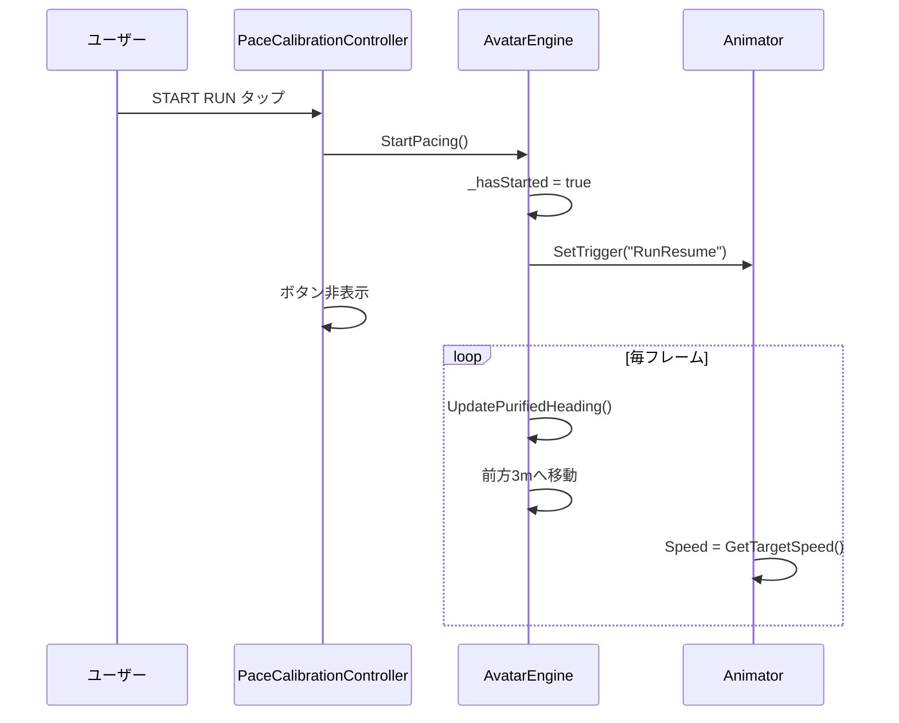
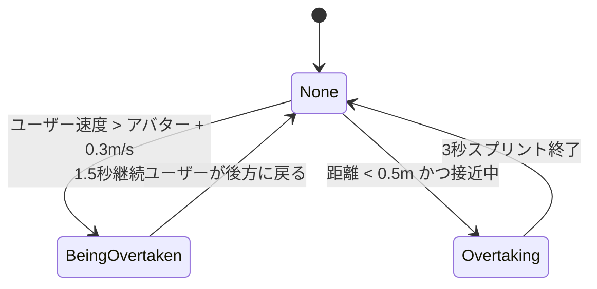

# AR Pacesetter

ARランニングペーサー — 3.0m前方を走る半透明アバターとの距離感でペースを保つ。
**第1期(検証フェーズ)は iPhone + XREAL ARグラス(USB-C有線)の2台構成**。Apple Watch 連携等は実装済みだがスコープ外。

| 知りたいこと | 読む場所 |
|---|---|
| 第1期スコープ・機能一覧(F-01〜F-11)・仕様値 | [CLAUDE.md](CLAUDE.md) |
| 数式・GPS FSM・レイテンシ予算・検証手順・実装の不変条件 | [AGENTS.md](AGENTS.md) |
| 機能→実装→検証の対応表 | [HANDOVER.md](HANDOVER.md) |
| Swift⇄Unity 連携 | [SWIFT_INTEGRATION.md](SWIFT_INTEGRATION.md) |
| 変更の経緯 | [CHANGELOG.md](CHANGELOG.md) |
| 発表用の素材 | [Docs/PRESENTATION.md](Docs/PRESENTATION.md) |

---

## 目次

1. [開発の手順](#1-開発の手順)
2. [コード実行のフローチャート](#2-コード実行のフローチャート)
3. [Swift UI連携（AR-runner）](#3-swift-ui連携ar-runner)

---

## 1. 開発の手順

### 全体アーキテクチャ

| デバイス | 役割 | 技術 |
|---|---|---|
| **iPhone** | 空間処理・センサー融合・状態管理・描画命令生成 | Swift / ARKit + Unity (UaaL) |
| **XREAL One/Eye（ARグラス）** | アバター＋HUD投影 | USB-C（DisplayPort Alt Mode） |
| Apple Watch（第1期スコープ外） | 心拍数（BPM）・ランニングピッチ（SPM） | BLE |

Unity側（本リポジトリ）は空間エンジン・FSM・描画を担い、SwiftUIアプリ（`ios/`）に Unity as a Library として組み込まれる。
カルマンフィルタは C# の `SpatialKalmanFilter` で、エディタと実機で共通。

### 開発フェーズ（推奨順序）



#### Phase 1 — 空間エンジン基盤

- `AvatarEngine.cs`：ペース計算、前方3mリード距離、Vector Forward Purification
- `OvertakeBehaviourController.cs`：追い抜きアニメーション連携
- Mixamo/VRChatモデル統合（`AvatarModelSwitcher.cs`）

#### Phase 2 — 地形追従・障害物検知

- `GroundSnap.cs`：LiDAR相当のRaycast/SphereCast、Ground Snap（±15cm / 0.3s）
- 崖・壁検知 → In-Place Jog 状態へ遷移

#### Phase 3 — GPSフォールトトレランス（FSM）

- `GameStateController.cs`：5状態FSM（Normal → Inertial → FadeOut → Standby → ReAccumulation）
- GPS喪失時の慣性移動、1秒フェードアウト、精度≤5mゲート

#### Phase 4 — UI・キャリブレーション

- `PaceCalibrationController.cs`：ペーススライダー（3:30〜7:00/km）
- **START RUN** ボタン：開始前はその場ジョグ＋ユーザー向き

#### Phase 5 — バイオメトリクス連携（第1期スコープ外）

- `HeartRateReceiver.cs` → `AvatarVisualsAndActions.cs`（バイオルミネッセンス）
- `PeripheralHUDManager.cs`：BPM / SPM / 距離 / 時間表示
- iOSネイティブ：`Plugins/iOS/HeartRatePlugin.mm`（BLE）

#### Phase 6 — 分析・安全・ベンチマーク

- `AnalyticsManager.cs`：Synchronicity Rate、疲労指数、S〜Dグレード
- `SafetyAndSystemController.cs`：TTC（Time-To-Collision）警告、低バッテリー退避 — **未配線・実行時に不在**（HANDOVER.md §5）
- `LatencyBenchmarkRunner.cs`：Motion-to-Photon ≤20ms 検証（Bキー）

#### Phase 7 — 実機統合（本番）

- カルマンフィルタ（`SpatialKalmanFilter.cs`・C#純ロジック。旧C++版は 2026-09-11 に廃止）
- Swift側 ARKit/CoreLocation からGPS精度・位置を供給
- USB-C IMU 100Hz パイプライン接続

### エディタ検証用ショートカットキー一覧

| キー | 機能 |
|---|---|
| **G** | GPS喪失シミュレーション |
| **R** | GPS復帰 |
| **A** | GPS精度≤5m（ReAccumulation解除） |
| **C** | 崖・障害物シミュレーション |
| **O / P** | 追い抜かれる / 追い抜く動作 |
| **B** | レイテンシベンチマークHUD |
| ~~**T**~~ | ~~TTC衝突警告シミュレーション~~ — **無効**（`SafetyAndSystemController`が未配線のため。HANDOVER.md §5） |
| **D** | ルート逸脱シミュレーション |
| **V** | 心拍スパイク（195BPM×6秒 → バイタル警告・深青） |
| **M** | 環境騒音シミュレーション（>45dB → 自動音量調整） |
| **Y** | 低バッテリーHUD黄色点滅プレビュー（押している間） |
| **F** | 長押し1.5秒で走行終了 → リザルト画面 |
| **F1 / F2 / F3** | ARグラス / Watch / イヤホン 接続切替（Readyチェック） |

Swiftコマンドのシミュレート: Hierarchyで `ARSessionManager` を選択 → Inspectorコンテキストメニュー
（StartSession / UpdateMetrics / EndSession / Goal Reached / RequestHistory / Ghost Run）。
離隔待機は再生中にSceneビューでカメラ（XR Origin）をアバターから10m以上引き離すと発動。

### E2E自動検証

「開始→走行→ゴール自動終了→記録保存→ゴースト再走→GPS喪失/復帰→履歴」を自動実行して判定:

- エディタ: メニュー **Build → Run E2E Scenario**（Play Modeが起動し、Consoleに `[E2E] PASS/FAIL` が流れる）
- CLI（ヘッドレス）:
  ```
  Unity.exe -batchmode -projectPath <repo> -executeMethod E2EScenarioRunner.Run -logFile e2e.log
  ```
  終了コード 0=全PASS / 1=FAILあり。ログの `[E2E] SUMMARY` を参照。

### 主要スクリプト一覧

| スクリプト | 役割 |
|---|---|
| `AvatarEngine.cs` | コアペーシングエンジン |
| `GroundSnap.cs` | 地形スナップ・崖検知 |
| `GameStateController.cs` | GPS FSM |
| `OvertakeBehaviourController.cs` | 追い抜きビジュアル |
| `PaceCalibrationController.cs` | ペースUI・START RUN |
| `PeripheralHUDManager.cs` | HUD表示 |
| `AnalyticsManager.cs` | 同期率・疲労・グレード |
| `HeartRateReceiver.cs` | BLE心拍・ピッチ受信 |
| `AvatarVisualsAndActions.cs` | バイオルミネッセンス |
| `SafetyAndSystemController.cs` | TTC・低バッテリー（**未配線**） |
| `LatencyBenchmarkRunner.cs` | レイテンシベンチマーク |
| `SilentRouteRecoverer.cs` | ルート逸脱リカバリー |
| `AvatarModelSwitcher.cs` | アバターモデル切替 |
| `RunAudioEngine.cs` | サウンドシステム（足音・呼吸音・システム音・環境適応音響） |
| `RunSessionController.cs` | 走行終了フロー・ガードレイヤー・リザルト画面（Perfect〜Try Again＋アバターコメント） |
| `SafetyEventLogger.cs` | セーフティ・ロギング（急停止・速度超過・逸脱地点） |
| `SessionDataStore.cs` | セッション永続化（アプリ内JSON DB＋HealthKit同期キュー） |
| `ReadyCheckController.cs` | Readyチェック（4デバイス4色インジケーター・出走ゲート） |
| `UserProfile.cs` | オンボーディング身体情報（身長・体重・性別） |
| `AvatarVFXController.cs` | VFX演出（起動粒子集積・終了挨拶消滅・接地サイバーパルス） |
| `GhostPaceDriver.cs` | ゴースト機能（過去セッションの速度プロファイル再生） |
| `AvatarRigLocator.cs` | 有効なAnimatorの優先解決 |
| `ARVisionSystemsBootstrap.cs` | 新規マネージャーのシーン自動生成 |
| `ARSessionManagerBridge.cs` | Swift→Unity受信（StartSession/UpdateMetrics/EndSession）＋1Hz状態レポート |
| `DeviceManagerBridge.cs` | Swift→Unity受信（ConnectXREAL / DisconnectXREAL / UpdateGlassPose） |
| `GlassViewRig.cs` | ARグラス接続中の描画をグラスの画角・眼の位置・進行方向ヨーへ切り替える |
| `GlassDisplayProfile.cs` / `GlassOpticsMath.cs` | グラスの機種テーブルと光学計算（画角換算・視野適合） |
| `HeadPoseMath.cs` | 描画カメラの向きの供給元を決める（Anchorモードでの二重補正を回避） |
| `DevDiagnostics.cs` | 開発者モードの状態スナップショットと走行ログCSV一覧の組み立て |
| `FrameSmoothing.cs` | フレーム時間依存の平滑化を「長いフレームで瞬間移動しない」形にする |
| `VrmAvatarPolicy.cs` / `VrmAvatarLoader.cs` / `VrmAvatarCatalog.cs` | 差し替えアバター(VRM)の受け入れ判定・計測・入れ替え |
| `OutdoorSemanticClassifier.cs` | 屋外路面の画像分類（ARCore Scene Semantics）。未導入時は休眠 |
| `SwiftMessageSender.cs` | Unity→Swift送信（SyncRate/AvatarState/GPS/Latency/SessionEnded） |

> Swift UI（[kyainna/AR-runner](https://github.com/kyainna/AR-runner)）との連携手順は [SWIFT_INTEGRATION.md](SWIFT_INTEGRATION.md) を参照。


数式(ペース→速度・Vector Forward・接地・カルマンフィルタ・同期率・疲労係数など)は [AGENTS.md §4](AGENTS.md#4-core-mathematical-formulae--geometric-domain-logic) に一本化した。

---

## 2. コード実行のフローチャート

### メインゲームループ（毎フレーム）



### START RUN ボタン ～ ラン開始フロー



### GPSフォールトトレランス FSM

[AGENTS.md §5](AGENTS.md#5-state-machine-lifecycle-gps-fault-tolerance) を参照。

### 追い抜き状態マシン



| 状態 | 動作 |
|---|---|
| **BeingOvertaken** | 右に0.8mサイドステップ、頭をユーザーへ |
| **Overtaking** | 1.25×スプリント速度 |

---

## 3. Swift UI連携（AR-runner）

スマホアプリのUI（SwiftUI、元リポジトリ [kyainna/AR-runner](https://github.com/kyainna/AR-runner)）は
**本リポジトリの `ios/` に取り込み済み（モノレポ構成）**。
**Unity as a Library (UaaL)** 方式で、Swiftアプリがホストになり Unity を内部に取り込む。

### モノレポ構成

```
AR Pacesetter/                      ← リポジトリルート = Unityプロジェクト
├── Assets/ ...                     ← Unity本体
├── ios/
│   ├── ARRunner.xcworkspace        ← ★ Macで開くのはこれ（両プロジェクトを束ねる）
│   ├── AR_Runner_UI/               ← SwiftUIアプリ（ホスト・最終ビルド対象）
│   └── UnityExport/                ← Unityエクスポート産物（gitignore・生成物）
└── SWIFT_INTEGRATION.md
```

### ビルド構成の考え方（重要）

**Unity単体をビルドしても「Unityだけのアプリ」にしかならない。**
SwiftUI画面込みの完成アプリは、常に **AR_Runner_UIスキームからビルド**する。

```
① Unityエクスポート（Windows可）
   Unityメニュー Build → Export iOS (ios/UnityExport)
   （CLI: Unity.exe -batchmode -quit -projectPath <repo>
          -executeMethod IOSBuildExporter.ExportIOS   ※失敗時は終了コード1）
   → ios/UnityExport/Unity-iPhone.xcodeproj が生成される

② 統合ビルド（macOS環境。実機のみ — ARKitはシミュレータ不可）
   ios/ARRunner.xcworkspace を開く
   → 初回のみ(a): AR_Runner_UIターゲットに UnityFramework.framework を Embed & Sign
   → 初回のみ(b): Unity-iPhone側 Data フォルダの Target Membership を UnityFramework へ
   → AR_Runner_UIスキームで実機ビルド = SwiftUI + Unity 両方入りの1アプリ
```

つまり Unity側は「ビルドするもの」ではなく「**エクスポートして ios/UnityExport に置かれる部品**」。

**①の前提条件**（どれか欠けるとエクスポートは失敗する）:

- **Unity 6000.3.17f1**（`ProjectSettings/ProjectVersion.txt` と一致必須）
- **iOS Build Support モジュール**（Unity Hub → インストール → 対象バージョン → モジュールを加える）
- **Player Settings の使用目的文が空でないこと** — `Microphone`/`Location`/`Bluetooth` を
  スクリプトが使うため、空だと `BuildFailedException` になる。設定済み（Swiftアプリ側の
  `INFOPLIST_KEY_*` とは**別物**で、両方必要）
- エクスポート後は `ProjectSettings.asset` の差分を確認する。ビルド処理が `preloadedAssets` を
  空にすることがあり、`XRGeneralSettings.asset` が消えるとXR(ARKit)ローダーが初期化されなくなる

**②はMacの所有が必須ではない**: リポジトリが公開のためGitHub ActionsのmacOSランナーが無料で使える。
Windowsで①を実行 → 生成物をCIへ渡し、macOSランナーは `xcodebuild` のみ実行する構成にすると、
Unityをランナーへ入れずに済む。実機へ入れるには署名が必要（Apple Developer Program）で、
配布はTestFlightが最短。詳細と現状は SWIFT_INTEGRATION.md ② / HANDOVER.md §5 を参照。

**借りたMac + 無料Apple IDで1回だけビルドする場合**は、手順を1枚にまとめた
[Docs/BUILD_ON_BORROWED_MAC.md](Docs/BUILD_ON_BORROWED_MAC.md) を参照
(事前確認・USB転送・`tools/prepare-free-signing.sh`・Xcode設定・CSV回収・失敗時の対処)。

> **現状の注意**: ②が未実施の間、Swift側は `#if canImport(UnityFramework)` の偽実装で動作する。
> アプリはビルドも起動もでき統計もそれらしく表示されるが、**Unityには一切繋がっていない**。
> 走行画面に「Unity AR View (UnityFramework 未リンク)」が出ていたらこの状態。

### メッセージ契約（実装済み）

| 方向 | 経路 | 内容 |
|---|---|---|
| Swift → Unity | `sendMessageToGO` → GameObject `ARSessionManager` / `DeviceManager` の `OnSwiftCommand(json)` | `StartSession`（ペースkm/h・目標距離・身長・先行距離）/ `UpdateMetrics`（心拍・距離・**測位3値**）/ `EndSession` / `RequestHistory` / `ResumeSession` / `ConnectXREAL`（表示メトリクス付き）/ `DisconnectXREAL` / `UpdateGlassPose`（将来用）（計8種） |
| Unity → Swift | `UnitySwiftBridge.mm` → NSNotification `UnityToSwiftMessage` → `UnityBridge.onUnityMessage` | `SyncRateUpdated`(1Hz) / `AvatarStateChanged`(Idle・Run・Slow・Fast・Goal・Lost) / `GPSLost`・`GPSRecovered` / `LatencyReport` / `SessionEnded`（グレード・ランク・結果）/ `HistoryData` / `VoiceAlert` / ~~`LowBattery`~~（送出元が未配線のため現在発火しない） |

ブリッジ用GameObjectは起動時に自動生成されるためシーン配線は不要。
Swift側の本番配線は [`ios/AR_Runner_UI/AR_Runner_UI/UnityBridge.swift`](ios/AR_Runner_UI/AR_Runner_UI/UnityBridge.swift)（置き換え済み）と
[`UnityLauncher.swift`](ios/AR_Runner_UI/AR_Runner_UI/UnityLauncher.swift)（UnityFramework起動・`UnityContainerView`）。
UnityFramework未リンク時は自動でシミュレーションモードにフォールバックするため、SwiftUI単体開発（シミュレータ）も従来通り可能。

### テスト手順（3段階）

1. **Unity単体（Windows可・Xcode不要）**: シーン再生 → Hierarchyの`ARSessionManager`を選択 → Inspectorコンテキストメニューの「Simulate StartSession / UpdateMetrics / EndSession」。Consoleに `[Unity → Swift] {"event":...}` が1Hzで出れば送信側OK
2. **Swift単体（Mac・iOSシミュレータ可）**: 置き換え後のUnityBridge.swiftはUnityFramework未リンク時シミュレーションで動作
3. **統合（Mac + iPhone実機）**: 上記②の構成でビルド。ARKit/GPSは実機必須
4. **走行ログCSVの回収**: 実地テスト後、Xcode → Devices and Simulators → Download Container で
   `AppData/Documents/RunLogs/Log_*.csv` を取り出す（手順詳細: SWIFT_INTEGRATION.md ④）

詳細手順: [`SWIFT_INTEGRATION.md`](SWIFT_INTEGRATION.md)

---

## 関連ドキュメント

- [`AGENTS.md`](AGENTS.md) — 技術仕様（数式・FSM・レイテンシ予算・検証手順・不変条件）
- [`CHANGELOG.md`](CHANGELOG.md) — 更新履歴
- [`Docs/PRESENTATION.md`](Docs/PRESENTATION.md) — 発表資料に使えそうなネタ
- [`Assets/AvatarStateTransitions.md`](Assets/AvatarStateTransitions.md) — Animator状態遷移ガイド
- [`SWIFT_INTEGRATION.md`](SWIFT_INTEGRATION.md) — Swift UI（AR-runner）連携ガイド
- [`Docs/UNITY_AS_A_LIBRARY.md`](Docs/UNITY_AS_A_LIBRARY.md) / [`.ja`](Docs/UNITY_AS_A_LIBRARY.ja.md) — **UaaL汎用ガイド（英/日）**: SwiftUIアプリへUnityを組み込む手順と落とし穴
- [`HANDOVER.md`](HANDOVER.md) — 技術資産引き継ぎドキュメント（企画書要件→実装→検証の対応表・DoD）
- `Docs/AR-Vision_基本設計書_v2.docx` — 基本設計書（実装実態で全面記載）
- `Docs/AR-Vision_成果発表_draft.pptx` — 成果発表スライドのドラフト（9枚）

## ライセンス

（未設定）
