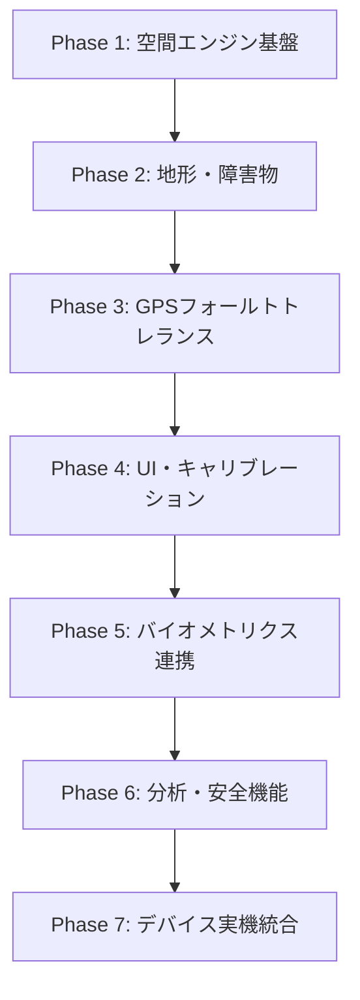
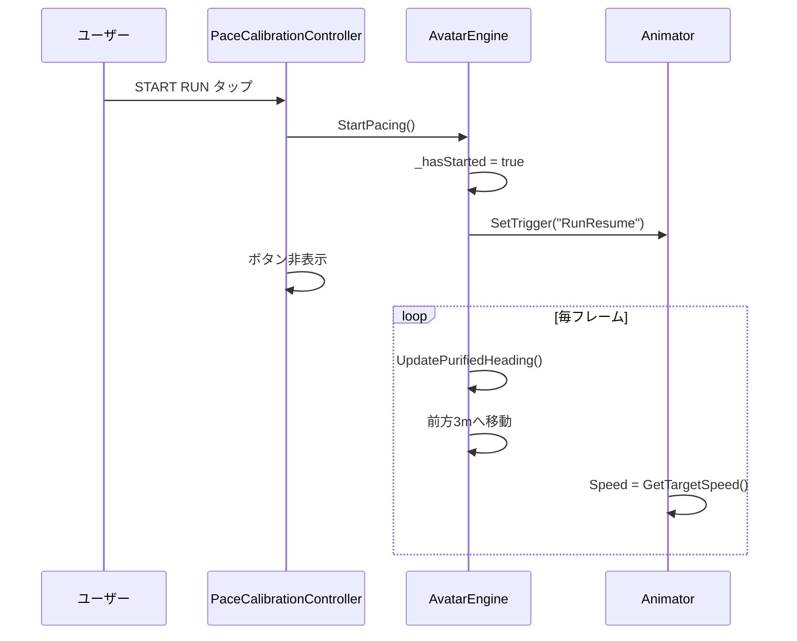
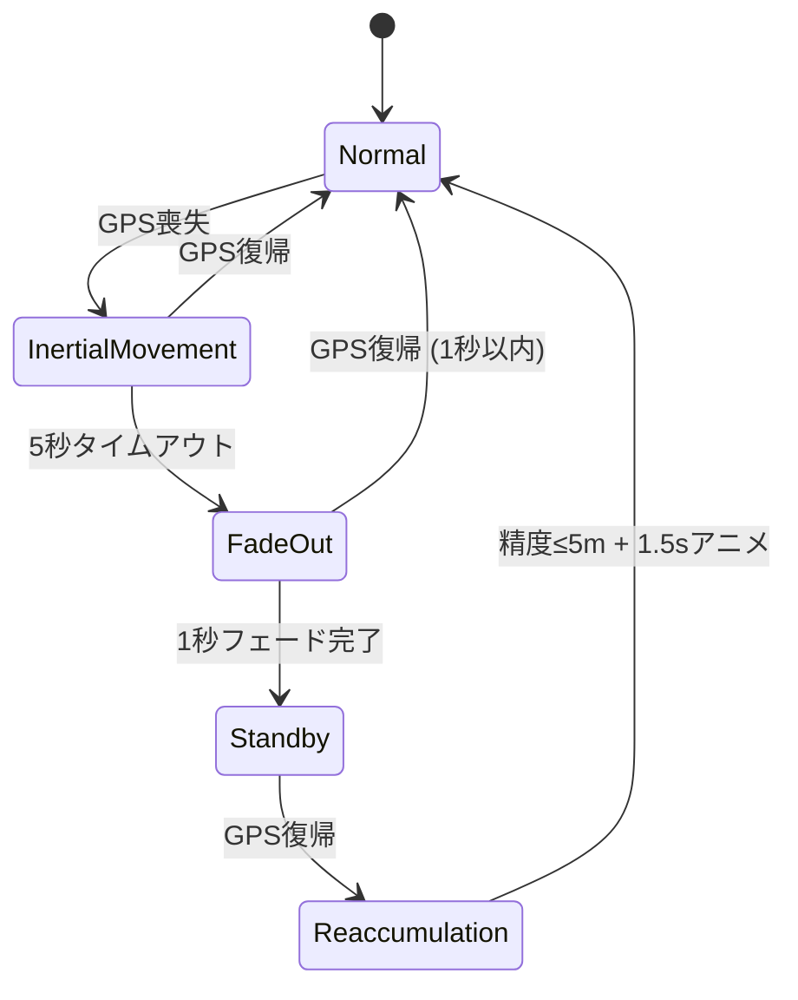
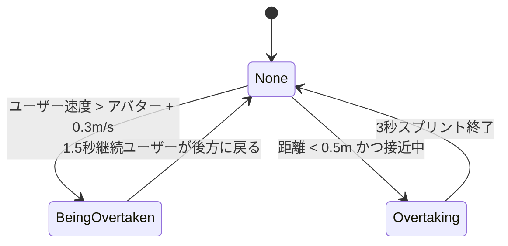

# AR Pacesetter

ARランニングペーサー — iPhone + XREAL AR Glass + Apple Watch 連携型ランニングコンパニオン。

---

## 目次

1. [開発の手順](#1-開発の手順)
2. [コードに使った物理演算・数式](#2-コードに使った物理演算数式)
3. [コード実行のフローチャート](#3-コード実行のフローチャート)
4. [発表資料に使えそうなネタ](#4-発表資料に使えそうなネタ)
5. [Swift UI連携（AR-runner）](#5-swift-ui連携ar-runner)
6. [更新履歴](#6-更新履歴)

---

## 1. 開発の手順

### 全体アーキテクチャ（3デバイス構成）

| デバイス | 役割 | 技術 |
|---|---|---|
| **iPhone** | 空間処理・センサー融合・状態管理・描画命令生成 | Swift / ARKit / Metal |
| **XREAL One/Eye（ARグラス）** | アバター＋HUD投影、IMUデータ返送 | USB-C（≥100Hz） |
| **Apple Watch** | 心拍数（BPM）・ランニングピッチ（SPM） | BLE |

Unity側（本リポジトリ）は **プロトタイプ／エディタ検証レイヤー** として、本番iOS向けC++カルマンフィルタ・BLEブリッジと連携する設計です。

### 開発フェーズ（推奨順序）



#### Phase 1 — 空間エンジン基盤

- `AvatarEngine.cs`：ペース計算、前方3mリード距離、Vector Forward Purification
- `OvertakeBehaviourController.cs`：追い抜きアニメーション連携
- Mixamo/VRChatモデル統合（`AvatarModelSwitcher.cs`）

#### Phase 2 — 地形追従・障害物検知

- `GroundSnap.cs`：LiDAR相当のRaycast/SphereCast、Ground Snap（±15cm / 0.3s）
- 崖・壁検知 → In-Place Jog 状態へ遷移

#### Phase 3 — GPSフォールトトレランス（FSM）

- `GameStateController.cs`：5状態FSM（Normal → Inertial → FadeOut → Standby → ReAccumulation）
- GPS喪失時の慣性移動、1秒フェードアウト、精度≤5mゲート

#### Phase 4 — UI・キャリブレーション

- `PaceCalibrationController.cs`：ペーススライダー（3:30〜7:00/km）
- **START RUN** ボタン：開始前はその場ジョグ＋ユーザー向き

#### Phase 5 — バイオメトリクス連携

- `HeartRateReceiver.cs` → `AvatarVisualsAndActions.cs`（バイオルミネッセンス）
- `PeripheralHUDManager.cs`：BPM / SPM / 距離 / 時間表示
- iOSネイティブ：`Plugins/iOS/HeartRatePlugin.mm`（BLE）

#### Phase 6 — 分析・安全・ベンチマーク

- `AnalyticsManager.cs`：Synchronicity Rate、疲労指数、S〜Dグレード
- `SafetyAndSystemController.cs`：TTC（Time-To-Collision）警告、低バッテリー退避
- `LatencyBenchmarkRunner.cs`：Motion-to-Photon ≤20ms 検証（Bキー）

#### Phase 7 — 実機統合（本番）

- C++カルマンフィルタ（`DllImport("__Internal")`）
- Swift側 ARKit/CoreLocation からGPS精度・位置を供給
- USB-C IMU 100Hz パイプライン接続

### エディタ検証用ショートカットキー一覧

| キー | 機能 |
|---|---|
| **G** | GPS喪失シミュレーション |
| **R** | GPS復帰 |
| **A** | GPS精度≤5m（ReAccumulation解除） |
| **C** | 崖・障害物シミュレーション |
| **O / P** | 追い抜かれる / 追い抜く動作 |
| **B** | レイテンシベンチマークHUD |
| **T** | TTC衝突警告シミュレーション |
| **D** | ルート逸脱シミュレーション |
| **V** | 心拍スパイク（195BPM×6秒 → バイタル警告・深青） |
| **M** | 環境騒音シミュレーション（>45dB → 自動音量調整） |
| **Y** | 低バッテリーHUD黄色点滅プレビュー（押している間） |
| **F** | 長押し1.5秒で走行終了 → リザルト画面 |
| **F1 / F2 / F3** | ARグラス / Watch / イヤホン 接続切替（Readyチェック） |

### 主要スクリプト一覧

| スクリプト | 役割 |
|---|---|
| `AvatarEngine.cs` | コアペーシングエンジン |
| `GroundSnap.cs` | 地形スナップ・崖検知 |
| `GameStateController.cs` | GPS FSM |
| `OvertakeBehaviourController.cs` | 追い抜きビジュアル |
| `PaceCalibrationController.cs` | ペースUI・START RUN |
| `PeripheralHUDManager.cs` | HUD表示 |
| `AnalyticsManager.cs` | 同期率・疲労・グレード |
| `HeartRateReceiver.cs` | BLE心拍・ピッチ受信 |
| `AvatarVisualsAndActions.cs` | バイオルミネッセンス |
| `SafetyAndSystemController.cs` | TTC・低バッテリー |
| `LatencyBenchmarkRunner.cs` | レイテンシベンチマーク |
| `SilentRouteRecoverer.cs` | ルート逸脱リカバリー |
| `AvatarModelSwitcher.cs` | アバターモデル切替 |
| `RunAudioEngine.cs` | サウンドシステム（足音・呼吸音・システム音・環境適応音響） |
| `RunSessionController.cs` | 走行終了フロー・ガードレイヤー・リザルト画面（Perfect〜Try Again＋アバターコメント） |
| `SafetyEventLogger.cs` | セーフティ・ロギング（急停止・速度超過・逸脱地点） |
| `SessionDataStore.cs` | セッション永続化（アプリ内JSON DB＋HealthKit同期キュー） |
| `ReadyCheckController.cs` | Readyチェック（4デバイス4色インジケーター・出走ゲート） |
| `UserProfile.cs` | オンボーディング身体情報（身長・体重・性別） |
| `ARVisionSystemsBootstrap.cs` | 新規マネージャーのシーン自動生成 |
| `ARSessionManagerBridge.cs` | Swift→Unity受信（StartSession/UpdateMetrics/EndSession）＋1Hz状態レポート |
| `DeviceManagerBridge.cs` | Swift→Unity受信（ConnectXREAL） |
| `SwiftMessageSender.cs` | Unity→Swift送信（SyncRate/AvatarState/GPS/Latency/SessionEnded） |

> Swift UI（[kyainna/AR-runner](https://github.com/kyainna/AR-runner)）との連携手順は [SWIFT_INTEGRATION.md](SWIFT_INTEGRATION.md) を参照。

---

## 2. コードに使った物理演算・数式

### A. ペース → 速度変換

`AvatarEngine.CalculateVelocityMatrix()`：

```
v_target = 1000 / (P × 60)   [m/s]
```

（P = 分/km。例：5:00/km → 3.33 m/s）

### B. アバター位置（Vector Forward Purification）

```
P_avatar = P_user + 3.0 × V_forward
```

- 直近 **1.5秒** のGPS移動ベクトルを積算
- **指数重み付き移動平均**（新しいフレームほど重い）：

```
w_i = e^(-2.5 × age_i)
V_forward = Σ(w_i × d_i) / Σ(w_i)
```

- **Gaze Lock**：GPS移動が微小（< 0.02m）のとき、視線（`userCamera.forward`）は使わず方向を保持 → 首振りによる酔い防止

### C. エラスティックバンド速度維持（Feature #3）

| 条件 | 速度倍率 |
|---|---|
| ユーザーが遅れ（リード超過） | 0.5× まで減速 |
| ユーザーが接近 | 1.2× 加速 |
| スプリント追い抜き | 1.25× |

### D. ジッターガード（Motion-to-Photon）

- 閾値：± 5 ms
- スパイク時：前フレームのKalman速度で **予測補間**

### E. 地形追従（Ground Snap）

**Raycast（垂直）**：

```csharp
Physics.RaycastAll(origin, Vector3.down, 20m, environmentLayerMask)
```

**SmoothDamp（±15cm超の高さ変化）**：

```csharp
Mathf.SmoothDamp(currentY, targetY, ref velocity, smoothTime=0.3s)
```

**SphereCast（水平・崖検知）**：

```csharp
Physics.SphereCastAll(origin, radius=0.4m, forward, distance=3.0m)
```

- 障害物高さ ≥ 1.5m、前方3m以内 → 停止

### F. カルマンフィルタ（C++ / エディタ近似）

本番（iOS）：

```csharp
UpdateKalmanFilter(rawX, rawY, rawZ, out smoothX, out smoothY, out smoothZ)
```

エディタ近似（`LatencyBenchmarkRunner`）：

```
K = P / (P + R)
x̂ = z × K
P ← (1 - K)(P + Q)
```

（Q = 0.05, R = 0.80）

### G. Synchronicity Rate（同期率）

```
S = 100 × (1 - d/10)   (d < 10m)
S = 0%                 (d ≥ 10m)
```

**グレード判定**（S〜D）：平均同期率 90 / 80 / 65 / 50% 閾値

### H. 疲労補正係数 C_f

```
C_f = 1.0   (T < 28°C)
C_f = 1.5   (28°C ≤ T < 31°C)
C_f = 2.0   (T ≥ 31°C)

Fatigue += (100 - S) × 0.01 × Δt × C_f
```

### I. バイオルミネッセンス（心拍連動グロー）

```
pulseFrequency = (heartRate / 60) × 2π
intensity = baseIntensity + sin(t × pulseFrequency/2) × amplitude
finalColor = baseColor × intensity
```

- 10m以上離れると **アンバー警告色** に切替

### J. TTC（Time-To-Collision）

```
TTC = d_obstacle / v_closing
```

TTC ≤ 1.5s → 赤フラッシュ＋警告音

### K. ルート逸脱（Cross-Track Error）

点 P から線分 AB への最短距離（射影 clamp）：

```
t = clamp(dot(AP, AB) / |AB|², 0, 1)
closest = A + t × AB
distance = |P - closest|
```

≥ 5m でサイレントリカバリーモード。

### L. 回転制限（Curved Motion）

最大 **45°/s** の旋回速度キャップ（`Quaternion.RotateTowards`）。

---

## 3. コード実行のフローチャート

### メインゲームループ（毎フレーム）


### START RUN ボタン ～ ラン開始フロー



### GPSフォールトトレランス FSM



### 追い抜き状態マシン



| 状態 | 動作 |
|---|---|
| **BeingOvertaken** | 右に0.8mサイドステップ、頭をユーザーへ |
| **Overtaking** | 1.25×スプリント速度 |

---

## 4. 発表資料に使えそうなネタ

### 技術的訴求ポイント

| ネタ | 内容 | インパクト |
|---|---|---|
| **Motion-to-Photon ≤20ms** | 酔い防止の厳格なレイテンシ予算。Bキーでリアルタイム計測HUD | ARランニングの差別化 |
| **Gaze Lock（視線ロック）** | 視線ではなくGPS移動で方向決定 → 首振り酔いゼロ | 人間工学・UX |
| **エラスティックバンド** | ランニングコーチが「引っ張りすぎない」自然な距離維持 | プロダクト体験 |
| **In-Place Jog at Cliff** | 崖・壁の前で止まり対面ジョグ → クリッピング防止 | LiDAR/Physics活用 |
| **3デバイス連携** | iPhone + AR Glass + Apple Watch の役割分担 | ハードウェアエコシステム |
| **バイオルミネッセンス** | 心拍に同期したアバターグロー + 10m離れるとアンバー | 視覚的フィードバック |
| **Synchronicity Rate** | ゲーミフィケーション（S〜Dグレード） | 継続利用・モチベーション |
| **暑さ疲労補正 C_f** | 気温28/31°Cで疲労指数1.5×/2.0× | スポーツ科学 × IoT |

### デモシナリオ案

1. **基本デモ**：START RUN → 5:00/kmペースで前方3mを走る → スライダーで4:30/kmに変更
2. **追い抜きデモ**：O/Pキーで「追い抜かれる→譲る」「追い抜く→スプリント」
3. **GPS喪失デモ**：G → 慣性移動 → 5秒後フェードアウト → R → 再出現＋Nod
4. **崖デモ**：CキーでIn-Place Jog → 解除後に再開
5. **ベンチマークデモ**：Bキーで20ms予算の各ステージ計測表示
6. **バイオメトリクス**：Editor上でBPM/SPMがリアルタイム変動、アバターが脈動

### システム構成図

```
┌─────────────────────────────────────────────────────┐
│  AR Pacesetter システム構成                          │
├──────────────┬──────────────┬───────────────────────┤
│ Apple Watch  │   iPhone     │   XREAL AR Glass      │
│  BPM / SPM   │  空間エンジン │   アバター + HUD      │
│   (BLE)      │  Kalman(C++) │   IMU 100Hz (USB-C)   │
└──────┬───────┴──────┬───────┴───────────┬───────────┘
       │              │                   │
       └──────────────┴───────────────────┘
              Motion-to-Photon ≤ 20ms
```

### 数値KPI

| 指標 | 値 |
|---|---|
| リード距離 | 3.0 m |
| ペース範囲 | 3:30 〜 7:00 /km |
| 旋回速度上限 | 45 °/s |
| ジッター許容 | ± 5 ms |
| 崖検知距離 | 3.0 m（高さ ≥ 1.5 m） |
| 同期率ゼロ距離 | ≥ 10 m |
| GPS復帰精度ゲート | ≤ 5 m |
| TTC警告閾値 | 1.5 s |
| 低バッテリー退避 | ≤ 10 % |
| IMUサンプリング | ≥ 100 Hz |
| HUDフレームレート | 60 fps |
| Motion-to-Photon予算 | ≤ 20 ms |

### Motion-to-Photon レイテンシ配分

| ステージ | 予算 |
|---|---|
| IMU Data Acquisition (USB-C) | ≤ 2 ms |
| Kalman Filter (C++) | ≤ 4 ms |
| AR Frame Command Generation | ≤ 6 ms |
| USB-C Frame Transmission | ≤ 8 ms |
| **合計** | **≤ 20 ms** |

### Future Work

- Swift/ARKit 本番パイプラインとの完全統合
- 実LiDAR（iPhone Pro）からの地形メッシュ入力
- Apple Watch ランニングピッチ → ペース自動調整フィードバック
- ルートGPXインポート + `SilentRouteRecoverer` 本番化
- マルチユーザー同期ラン（複数アバター）

---

## 5. Swift UI連携（AR-runner）

スマホアプリのUI（SwiftUI、元リポジトリ [kyainna/AR-runner](https://github.com/kyainna/AR-runner)）は
**本リポジトリの `ios/` に取り込み済み（モノレポ構成）**。
**Unity as a Library (UaaL)** 方式で、Swiftアプリがホストになり Unity を内部に取り込む。

### モノレポ構成

```
AR Pacesetter/                      ← リポジトリルート = Unityプロジェクト
├── Assets/ ...                     ← Unity本体
├── ios/
│   ├── ARRunner.xcworkspace        ← ★ Macで開くのはこれ（両プロジェクトを束ねる）
│   ├── AR_Runner_UI/               ← SwiftUIアプリ（ホスト・最終ビルド対象）
│   └── UnityExport/                ← Unityエクスポート産物（gitignore・生成物）
└── SWIFT_INTEGRATION.md
```

### ビルド構成の考え方（重要）

**Unity単体をビルドしても「Unityだけのアプリ」にしかならない。**
SwiftUI画面込みの完成アプリは、常に **AR_Runner_UIスキームからビルド**する。

```
① Unityエクスポート（Windows可）
   Unityメニュー Build → Export iOS (ios/UnityExport)
   → ios/UnityExport/Unity-iPhone.xcodeproj が生成される

② 統合ビルド（Mac）
   ios/ARRunner.xcworkspace を開く
   → 初回のみ: AR_Runner_UIターゲットに UnityFramework.framework を Embed & Sign
   → AR_Runner_UIスキームで実機ビルド = SwiftUI + Unity 両方入りの1アプリ
```

つまり Unity側は「ビルドするもの」ではなく「**エクスポートして ios/UnityExport に置かれる部品**」。

### メッセージ契約（実装済み）

| 方向 | 経路 | 内容 |
|---|---|---|
| Swift → Unity | `sendMessageToGO` → GameObject `ARSessionManager` / `DeviceManager` の `OnSwiftCommand(json)` | `StartSession`（ペースkm/h・目標距離・身長・先行距離）/ `UpdateMetrics`（心拍・距離）/ `EndSession` / `ConnectXREAL` |
| Unity → Swift | `UnitySwiftBridge.mm` → NSNotification `UnityToSwiftMessage` → `UnityBridge.onUnityMessage` | `SyncRateUpdated`(1Hz) / `AvatarStateChanged`(Idle・Run・Slow・Fast・Goal・Lost) / `GPSLost`・`GPSRecovered` / `LatencyReport` / `SessionEnded`（グレード・ランク・結果） |

ブリッジ用GameObjectは起動時に自動生成されるためシーン配線は不要。
Swift側の本番配線は [`ios/AR_Runner_UI/AR_Runner_UI/UnityBridge.swift`](ios/AR_Runner_UI/AR_Runner_UI/UnityBridge.swift)（置き換え済み）と
[`UnityLauncher.swift`](ios/AR_Runner_UI/AR_Runner_UI/UnityLauncher.swift)（UnityFramework起動・`UnityContainerView`）。
UnityFramework未リンク時は自動でシミュレーションモードにフォールバックするため、SwiftUI単体開発（シミュレータ）も従来通り可能。

### テスト手順（3段階）

1. **Unity単体（Windows可・Xcode不要）**: シーン再生 → Hierarchyの`ARSessionManager`を選択 → Inspectorコンテキストメニューの「Simulate StartSession / UpdateMetrics / EndSession」。Consoleに `[Unity → Swift] {"event":...}` が1Hzで出れば送信側OK
2. **Swift単体（Mac・iOSシミュレータ可）**: 置き換え後のUnityBridge.swiftはUnityFramework未リンク時シミュレーションで動作
3. **統合（Mac + iPhone実機）**: 上記②の構成でビルド。ARKit/GPSは実機必須

詳細手順: [`SWIFT_INTEGRATION.md`](SWIFT_INTEGRATION.md)

---

## 6. 更新履歴

### 2026-07-09 (2) — モノレポ化（SwiftUIアプリを ios/ に統合）

- [kyainna/AR-runner](https://github.com/kyainna/AR-runner) のSwiftUIアプリを `ios/AR_Runner_UI/` に取り込み
- `ios/ARRunner.xcworkspace` 新設 — AR_Runner_UI と Unityエクスポート産物を1ワークスペースで管理
- `UnityLauncher.swift` 新規 — UnityFramework起動（runEmbedded）+ SwiftUI用 `UnityContainerView`
- `UnityBridge.swift` を本番配線版に置き換え（`Docs/Swift/` は廃止しアプリ内へ移動）
- Unityメニュー **Build → Export iOS (ios/UnityExport)** 追加（`Assets/Editor/IOSBuildExporter.cs`）
- `.gitignore` に `ios/UnityExport/`（生成物）・xcuserdata を追加

### 2026-07-09 — 資料ベース機能実装・接地バグ修正・Swift連携

**企画書・要件定義書ベースの新機能**（詳細は各スクリプト参照）

| 機能 | 実装 |
|---|---|
| サウンドシステム（足音・心拍連動呼吸音・カウントダウン/ゴール音・45dB環境適応音響） | `RunAudioEngine.cs`（全クリップ実行時手続き生成・アセット不要） |
| バイタル警告（心拍185BPM以上で深青＋CalmDownSignトリガー） | `AvatarVisualsAndActions.cs` |
| 走行終了フロー・リザルト（Perfect〜Try Again 4段階＋S〜D＋アバターコメント生成） | `RunSessionController.cs`（HOLD TO FINISH 1.5秒長押し） |
| セーフティ・ロギング（急停止・速度超過・逸脱地点） | `SafetyEventLogger.cs` |
| デュアル・データ保存（アプリ内JSON DB＋HealthKit同期キュー） | `SessionDataStore.cs` |
| Readyチェック（4デバイス4色インジケーター・出走ゲート） | `ReadyCheckController.cs` |
| オンボーディング（身長・体重・性別）＋ハイブリッド入力（±5秒ボタン）＋ガードレイヤー・スリープ制御 | `PaceCalibrationController.cs` / `UserProfile.cs` |
| バッテリー10%以下のHUD黄色点滅 | `PeripheralHUDManager.cs` |

**接地バグ修正（アバターが地面の上を正しく走れない問題）**

原因は3つの配線ミスの複合:
1. シーンに孤立した2つ目のAvatarEngine（カメラ参照null）が存在し、GroundSnapがそれを参照 → 削除・再接続
2. Animator参照がコンテナ上の無効化されたAnimatorを指し、表示中のY Bot（子の有効Animator）に`Speed`が届かずIdleのまま滑走 → `AvatarRigLocator.cs`で「有効・アクティブ・コントローラ付き」Animatorを優先解決
3. AvatarModelSwitcherのモデル参照が2つともUIアイコンを誤指定 → 無効参照を検出し実モデルを自動配線

あわせて接地レイキャストにトリガーコライダー無視を追加、`IsSessionEnded`フラグ新設（GroundSnapの`IsHalted`毎フレーム上書きと終了停止の競合を解消）。

**Swift UI連携** — 上記セクション5参照。

---

## 関連ドキュメント

- [`AGENTS.md`](AGENTS.md) — エージェント向け技術仕様（数式・FSM・レイテンシ予算）
- [`Assets/AvatarStateTransitions.md`](Assets/AvatarStateTransitions.md) — Animator状態遷移ガイド
- [`SWIFT_INTEGRATION.md`](SWIFT_INTEGRATION.md) — Swift UI（AR-runner）連携ガイド

## ライセンス

（未設定）
