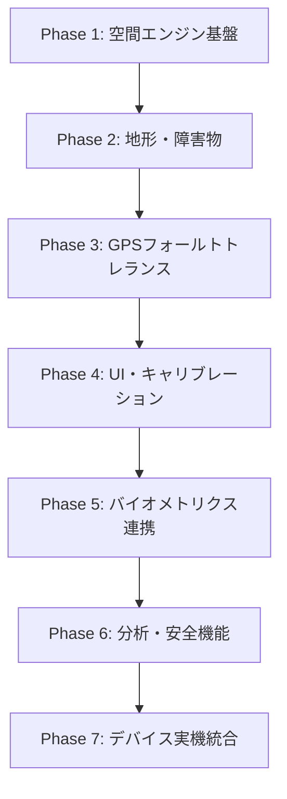
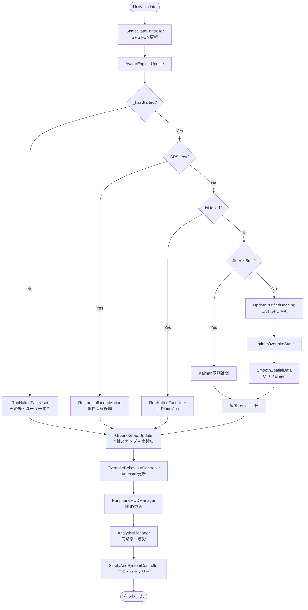
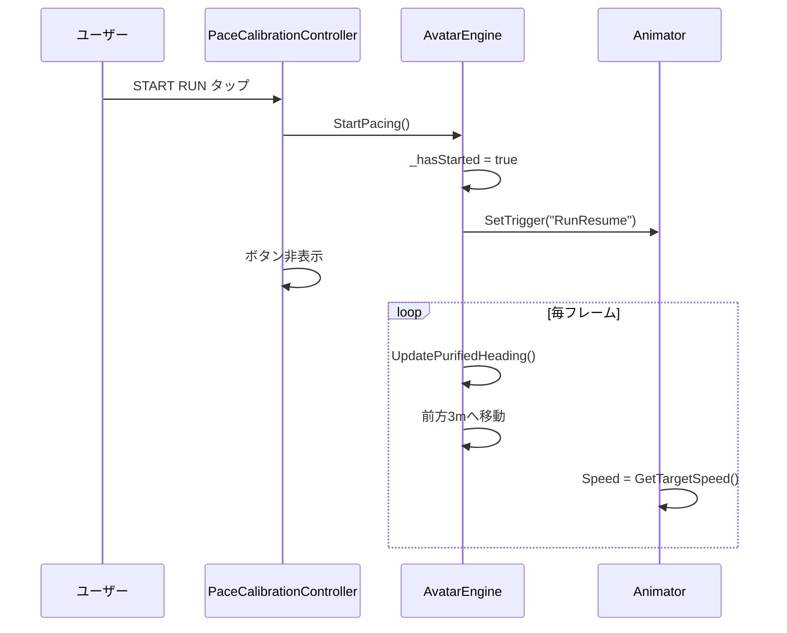
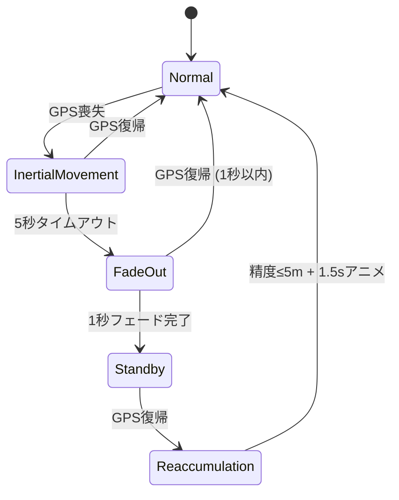
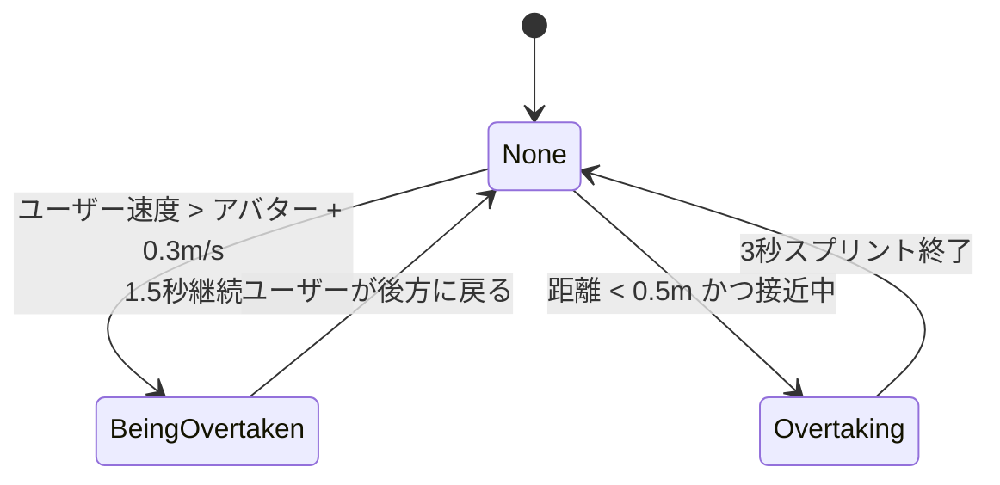

# AR Pacesetter

ARランニングペーサー — iPhone + XREAL AR Glass + Apple Watch 連携型ランニングコンパニオン。

---

## 目次

1. [開発の手順](#1-開発の手順)
2. [コードに使った物理演算・数式](#2-コードに使った物理演算数式)
3. [コード実行のフローチャート](#3-コード実行のフローチャート)
4. [発表資料に使えそうなネタ](#4-発表資料に使えそうなネタ)
5. [Swift UI連携（AR-runner）](#5-swift-ui連携ar-runner)
6. [更新履歴](#6-更新履歴)

---

## 1. 開発の手順

### 全体アーキテクチャ（3デバイス構成）

| デバイス | 役割 | 技術 |
|---|---|---|
| **iPhone** | 空間処理・センサー融合・状態管理・描画命令生成 | Swift / ARKit / Metal |
| **XREAL One/Eye（ARグラス）** | アバター＋HUD投影、IMUデータ返送 | USB-C（≥100Hz） |
| **Apple Watch** | 心拍数（BPM）・ランニングピッチ（SPM） | BLE |

Unity側（本リポジトリ）は **プロトタイプ／エディタ検証レイヤー** として、本番iOS向けC++カルマンフィルタ・BLEブリッジと連携する設計です。

### 開発フェーズ（推奨順序）



#### Phase 1 — 空間エンジン基盤

- `AvatarEngine.cs`：ペース計算、前方3mリード距離、Vector Forward Purification
- `OvertakeBehaviourController.cs`：追い抜きアニメーション連携
- Mixamo/VRChatモデル統合（`AvatarModelSwitcher.cs`）

#### Phase 2 — 地形追従・障害物検知

- `GroundSnap.cs`：LiDAR相当のRaycast/SphereCast、Ground Snap（±15cm / 0.3s）
- 崖・壁検知 → In-Place Jog 状態へ遷移

#### Phase 3 — GPSフォールトトレランス（FSM）

- `GameStateController.cs`：5状態FSM（Normal → Inertial → FadeOut → Standby → ReAccumulation）
- GPS喪失時の慣性移動、1秒フェードアウト、精度≤5mゲート

#### Phase 4 — UI・キャリブレーション

- `PaceCalibrationController.cs`：ペーススライダー（3:30〜7:00/km）
- **START RUN** ボタン：開始前はその場ジョグ＋ユーザー向き

#### Phase 5 — バイオメトリクス連携

- `HeartRateReceiver.cs` → `AvatarVisualsAndActions.cs`（バイオルミネッセンス）
- `PeripheralHUDManager.cs`：BPM / SPM / 距離 / 時間表示
- iOSネイティブ：`Plugins/iOS/HeartRatePlugin.mm`（BLE）

#### Phase 6 — 分析・安全・ベンチマーク

- `AnalyticsManager.cs`：Synchronicity Rate、疲労指数、S〜Dグレード
- `SafetyAndSystemController.cs`：TTC（Time-To-Collision）警告、低バッテリー退避 — **未配線・実行時に不在**（HANDOVER.md §5）
- `LatencyBenchmarkRunner.cs`：Motion-to-Photon ≤20ms 検証（Bキー）

#### Phase 7 — 実機統合（本番）

- C++カルマンフィルタ（`DllImport("__Internal")`）
- Swift側 ARKit/CoreLocation からGPS精度・位置を供給
- USB-C IMU 100Hz パイプライン接続

### エディタ検証用ショートカットキー一覧

| キー | 機能 |
|---|---|
| **G** | GPS喪失シミュレーション |
| **R** | GPS復帰 |
| **A** | GPS精度≤5m（ReAccumulation解除） |
| **C** | 崖・障害物シミュレーション |
| **O / P** | 追い抜かれる / 追い抜く動作 |
| **B** | レイテンシベンチマークHUD |
| ~~**T**~~ | ~~TTC衝突警告シミュレーション~~ — **無効**（`SafetyAndSystemController`が未配線のため。HANDOVER.md §5） |
| **D** | ルート逸脱シミュレーション |
| **V** | 心拍スパイク（195BPM×6秒 → バイタル警告・深青） |
| **M** | 環境騒音シミュレーション（>45dB → 自動音量調整） |
| **Y** | 低バッテリーHUD黄色点滅プレビュー（押している間） |
| **F** | 長押し1.5秒で走行終了 → リザルト画面 |
| **F1 / F2 / F3** | ARグラス / Watch / イヤホン 接続切替（Readyチェック） |

Swiftコマンドのシミュレート: Hierarchyで `ARSessionManager` を選択 → Inspectorコンテキストメニュー
（StartSession / UpdateMetrics / EndSession / Goal Reached / RequestHistory / Ghost Run）。
離隔待機は再生中にSceneビューでカメラ（XR Origin）をアバターから10m以上引き離すと発動。

### E2E自動検証

「開始→走行→ゴール自動終了→記録保存→ゴースト再走→GPS喪失/復帰→履歴」を自動実行して判定:

- エディタ: メニュー **Build → Run E2E Scenario**（Play Modeが起動し、Consoleに `[E2E] PASS/FAIL` が流れる）
- CLI（ヘッドレス）:
  ```
  Unity.exe -batchmode -projectPath <repo> -executeMethod E2EScenarioRunner.Run -logFile e2e.log
  ```
  終了コード 0=全PASS / 1=FAILあり。ログの `[E2E] SUMMARY` を参照。

### 主要スクリプト一覧

| スクリプト | 役割 |
|---|---|
| `AvatarEngine.cs` | コアペーシングエンジン |
| `GroundSnap.cs` | 地形スナップ・崖検知 |
| `GameStateController.cs` | GPS FSM |
| `OvertakeBehaviourController.cs` | 追い抜きビジュアル |
| `PaceCalibrationController.cs` | ペースUI・START RUN |
| `PeripheralHUDManager.cs` | HUD表示 |
| `AnalyticsManager.cs` | 同期率・疲労・グレード |
| `HeartRateReceiver.cs` | BLE心拍・ピッチ受信 |
| `AvatarVisualsAndActions.cs` | バイオルミネッセンス |
| `SafetyAndSystemController.cs` | TTC・低バッテリー（**未配線**） |
| `LatencyBenchmarkRunner.cs` | レイテンシベンチマーク |
| `SilentRouteRecoverer.cs` | ルート逸脱リカバリー |
| `AvatarModelSwitcher.cs` | アバターモデル切替 |
| `RunAudioEngine.cs` | サウンドシステム（足音・呼吸音・システム音・環境適応音響） |
| `RunSessionController.cs` | 走行終了フロー・ガードレイヤー・リザルト画面（Perfect〜Try Again＋アバターコメント） |
| `SafetyEventLogger.cs` | セーフティ・ロギング（急停止・速度超過・逸脱地点） |
| `SessionDataStore.cs` | セッション永続化（アプリ内JSON DB＋HealthKit同期キュー） |
| `ReadyCheckController.cs` | Readyチェック（4デバイス4色インジケーター・出走ゲート） |
| `UserProfile.cs` | オンボーディング身体情報（身長・体重・性別） |
| `AvatarVFXController.cs` | VFX演出（起動粒子集積・終了挨拶消滅・接地サイバーパルス） |
| `GhostPaceDriver.cs` | ゴースト機能（過去セッションの速度プロファイル再生） |
| `ARSessionManagerBridge.cs` / `DeviceManagerBridge.cs` | Swift⇄Unityメッセージブリッジ |
| `SwiftMessageSender.cs` | Unity→Swift送信（SyncRate/状態/GPS/履歴/結果） |
| `AvatarRigLocator.cs` | 有効なAnimatorの優先解決 |
| `ARVisionSystemsBootstrap.cs` | 新規マネージャーのシーン自動生成 |
| `ARSessionManagerBridge.cs` | Swift→Unity受信（StartSession/UpdateMetrics/EndSession）＋1Hz状態レポート |
| `DeviceManagerBridge.cs` | Swift→Unity受信（ConnectXREAL） |
| `SwiftMessageSender.cs` | Unity→Swift送信（SyncRate/AvatarState/GPS/Latency/SessionEnded） |

> Swift UI（[kyainna/AR-runner](https://github.com/kyainna/AR-runner)）との連携手順は [SWIFT_INTEGRATION.md](SWIFT_INTEGRATION.md) を参照。

---

## 2. コードに使った物理演算・数式

### A. ペース → 速度変換

`AvatarEngine.CalculateVelocityMatrix()`：

```
v_target = 1000 / (P × 60)   [m/s]
```

（P = 分/km。例：5:00/km → 3.33 m/s）

### B. アバター位置（Vector Forward Purification）

```
P_avatar = P_user + 3.0 × V_forward
```

- 直近 **1.5秒** のGPS移動ベクトルを積算
- **指数重み付き移動平均**（新しいフレームほど重い）：

```
w_i = e^(-2.5 × age_i)
V_forward = Σ(w_i × d_i) / Σ(w_i)
```

- **Gaze Lock**：GPS移動が微小（< 0.02m）のとき、視線（`userCamera.forward`）は使わず方向を保持 → 首振りによる酔い防止

### C. エラスティックバンド速度維持（Feature #3）

| 条件 | 速度倍率 |
|---|---|
| ユーザーが遅れ（リード超過） | 0.5× まで減速 |
| ユーザーが接近 | 1.2× 加速 |
| スプリント追い抜き | 1.25× |

### D. ジッターガード（Motion-to-Photon）

- 閾値：± 5 ms
- スパイク時：前フレームのKalman速度で **予測補間**

### E. 地形追従（Ground Snap）

**Raycast（垂直）**：

```csharp
Physics.RaycastAll(origin, Vector3.down, 20m, environmentLayerMask)
```

**SmoothDamp（±15cm超の高さ変化）**：

```csharp
Mathf.SmoothDamp(currentY, targetY, ref velocity, smoothTime=0.3s)
```

**SphereCast（水平・崖検知）**：

```csharp
Physics.SphereCastAll(origin, radius=0.4m, forward, distance=3.0m)
```

- 障害物高さ ≥ 1.5m、前方3m以内 → 停止

### F. カルマンフィルタ（C++ / エディタ近似）

本番（iOS）：

```csharp
UpdateKalmanFilter(rawX, rawY, rawZ, out smoothX, out smoothY, out smoothZ)
```

エディタ近似（`LatencyBenchmarkRunner`）：

```
K = P / (P + R)
x̂ = z × K
P ← (1 - K)(P + Q)
```

（Q = 0.05, R = 0.80）

### G. Synchronicity Rate（同期率）

```
S = 100 × (1 - d/10)   (d < 10m)
S = 0%                 (d ≥ 10m)
```

**グレード判定**（S〜D）：平均同期率 90 / 80 / 65 / 50% 閾値

### H. 疲労補正係数 C_f

```
C_f = 1.0   (T < 28°C)
C_f = 1.5   (28°C ≤ T < 31°C)
C_f = 2.0   (T ≥ 31°C)

Fatigue += (100 - S) × 0.01 × Δt × C_f
```

### I. バイオルミネッセンス（心拍連動グロー）

```
pulseFrequency = (heartRate / 60) × 2π
intensity = baseIntensity + sin(t × pulseFrequency/2) × amplitude
finalColor = baseColor × intensity
```

- 10m以上離れると **アンバー警告色** に切替

### J. TTC（Time-To-Collision）

```
TTC = d_obstacle / v_closing
```

TTC ≤ 1.5s → 赤フラッシュ＋警告音

> **注意**: この式を実装する `SafetyAndSystemController` は現在シーンにもBootstrapにも登録されておらず、
> 実行時に生成されない（HANDOVER.md §5）。有効化前に「非検出時のTTC」の扱いを修正すること。

### K. ルート逸脱（Cross-Track Error）

点 P から線分 AB への最短距離（射影 clamp）：

```
t = clamp(dot(AP, AB) / |AB|², 0, 1)
closest = A + t × AB
distance = |P - closest|
```

≥ 5m でサイレントリカバリーモード。

### L. 回転制限（Curved Motion）

最大 **45°/s** の旋回速度キャップ（`Quaternion.RotateTowards`）。

---

## 3. コード実行のフローチャート

### メインゲームループ（毎フレーム）



### START RUN ボタン ～ ラン開始フロー



### GPSフォールトトレランス FSM



### 追い抜き状態マシン



| 状態 | 動作 |
|---|---|
| **BeingOvertaken** | 右に0.8mサイドステップ、頭をユーザーへ |
| **Overtaking** | 1.25×スプリント速度 |

---

## 4. 発表資料に使えそうなネタ

### 技術的訴求ポイント

| ネタ | 内容 | インパクト |
|---|---|---|
| **Motion-to-Photon ≤20ms** | 酔い防止の厳格なレイテンシ予算。Bキーでリアルタイム計測HUD | ARランニングの差別化 |
| **Gaze Lock（視線ロック）** | 視線ではなくGPS移動で方向決定 → 首振り酔いゼロ | 人間工学・UX |
| **エラスティックバンド** | ランニングコーチが「引っ張りすぎない」自然な距離維持 | プロダクト体験 |
| **In-Place Jog at Cliff** | 崖・壁の前で止まり対面ジョグ → クリッピング防止 | LiDAR/Physics活用 |
| **3デバイス連携** | iPhone + AR Glass + Apple Watch の役割分担 | ハードウェアエコシステム |
| **バイオルミネッセンス** | 心拍に同期したアバターグロー + 10m離れるとアンバー | 視覚的フィードバック |
| **Synchronicity Rate** | ゲーミフィケーション（S〜Dグレード） | 継続利用・モチベーション |
| **暑さ疲労補正 C_f** | 気温28/31°Cで疲労指数1.5×/2.0× | スポーツ科学 × IoT |
| **ゴースト機能** | 過去の自分の速度プロファイル（5秒毎サンプル）と競走 | Corbett(2012)の生理学的根拠を実装 |
| **手続き生成サウンド** | 足音・呼吸音・システム音を全て実行時合成（アセットゼロ） | 技術的ユニークネス |
| **E2E自動検証** | ヘッドレスUnityで32項目自動判定。コーナー追従: 先行1.0〜2.4m・方位誤差6° | 品質保証・CI対応 |
| **SwiftUI×Unity モノレポ** | UaaLで1つのXcodeアプリに統合、双方向JSONブリッジ | アーキテクチャ |

### デモシナリオ案

1. **基本デモ**：START RUN → 5:00/kmペースで前方3mを走る → スライダーで4:30/kmに変更
2. **追い抜きデモ**：O/Pキーで「追い抜かれる→譲る」「追い抜く→スプリント」
3. **GPS喪失デモ**：G → 慣性移動 → 5秒後フェードアウト → R → 再出現＋Nod
4. **崖デモ**：CキーでIn-Place Jog → 解除後に再開
5. **ベンチマークデモ**：Bキーで20ms予算の各ステージ計測表示
6. **バイオメトリクス**：Editor上でBPM/SPMがリアルタイム変動、アバターが脈動
7. **ゴーストデモ**：1本走ってゴール → 「Simulate Ghost Run」→ 過去の自分のペース配分でアバターが走る
8. **バイタル警告デモ**：Vキーで心拍195にスパイク → アバターが深青に変化＋CalmDownサイン
9. **E2Eデモ**：「Build → Run E2E Scenario」で32項目が自動でPASSしていく様子を見せる

### システム構成図

```
┌─────────────────────────────────────────────────────┐
│  AR Pacesetter システム構成                          │
├──────────────┬──────────────┬───────────────────────┤
│ Apple Watch  │   iPhone     │   XREAL AR Glass      │
│  BPM / SPM   │  空間エンジン │   アバター + HUD      │
│   (BLE)      │  Kalman(C++) │   IMU 100Hz (USB-C)   │
└──────┬───────┴──────┬───────┴───────────┬───────────┘
       │              │                   │
       └──────────────┴───────────────────┘
              Motion-to-Photon ≤ 20ms
```

### 数値KPI

| 指標 | 値 |
|---|---|
| リード距離 | 3.0 m |
| ペース範囲 | 3:30 〜 7:00 /km |
| 旋回速度上限 | 45 °/s |
| ジッター許容 | ± 5 ms |
| 崖検知距離 | 3.0 m（高さ ≥ 1.5 m） |
| 同期率ゼロ距離 | ≥ 10 m |
| GPS復帰精度ゲート | ≤ 5 m |
| TTC警告閾値 | 1.5 s |
| 低バッテリー退避 | ≤ 10 % |
| IMUサンプリング | ≥ 100 Hz |
| HUDフレームレート | 60 fps |
| Motion-to-Photon予算 | ≤ 20 ms |

### Motion-to-Photon レイテンシ配分

| ステージ | 予算 |
|---|---|
| IMU Data Acquisition (USB-C) | ≤ 2 ms |
| Kalman Filter (C++) | ≤ 4 ms |
| AR Frame Command Generation | ≤ 6 ms |
| USB-C Frame Transmission | ≤ 8 ms |
| **合計** | **≤ 20 ms** |

### Future Work

- Swift/ARKit 本番パイプラインとの完全統合
- 実LiDAR（iPhone Pro）からの地形メッシュ入力
- Apple Watch ランニングピッチ → ペース自動調整フィードバック
- ルートGPXインポート + `SilentRouteRecoverer` 本番化
- マルチユーザー同期ラン（複数アバター）

---

## 5. Swift UI連携（AR-runner）

スマホアプリのUI（SwiftUI、元リポジトリ [kyainna/AR-runner](https://github.com/kyainna/AR-runner)）は
**本リポジトリの `ios/` に取り込み済み（モノレポ構成）**。
**Unity as a Library (UaaL)** 方式で、Swiftアプリがホストになり Unity を内部に取り込む。

### モノレポ構成

```
AR Pacesetter/                      ← リポジトリルート = Unityプロジェクト
├── Assets/ ...                     ← Unity本体
├── ios/
│   ├── ARRunner.xcworkspace        ← ★ Macで開くのはこれ（両プロジェクトを束ねる）
│   ├── AR_Runner_UI/               ← SwiftUIアプリ（ホスト・最終ビルド対象）
│   └── UnityExport/                ← Unityエクスポート産物（gitignore・生成物）
└── SWIFT_INTEGRATION.md
```

### ビルド構成の考え方（重要）

**Unity単体をビルドしても「Unityだけのアプリ」にしかならない。**
SwiftUI画面込みの完成アプリは、常に **AR_Runner_UIスキームからビルド**する。

```
① Unityエクスポート（Windows可）
   Unityメニュー Build → Export iOS (ios/UnityExport)
   → ios/UnityExport/Unity-iPhone.xcodeproj が生成される

② 統合ビルド（Mac）
   ios/ARRunner.xcworkspace を開く
   → 初回のみ: AR_Runner_UIターゲットに UnityFramework.framework を Embed & Sign
   → AR_Runner_UIスキームで実機ビルド = SwiftUI + Unity 両方入りの1アプリ
```

つまり Unity側は「ビルドするもの」ではなく「**エクスポートして ios/UnityExport に置かれる部品**」。

### メッセージ契約（実装済み）

| 方向 | 経路 | 内容 |
|---|---|---|
| Swift → Unity | `sendMessageToGO` → GameObject `ARSessionManager` / `DeviceManager` の `OnSwiftCommand(json)` | `StartSession`（ペースkm/h・目標距離・身長・先行距離）/ `UpdateMetrics`（心拍・距離・**測位3値**）/ `EndSession` / `RequestHistory` / `ResumeSession` / `ConnectXREAL` / `DisconnectXREAL`（計7種） |
| Unity → Swift | `UnitySwiftBridge.mm` → NSNotification `UnityToSwiftMessage` → `UnityBridge.onUnityMessage` | `SyncRateUpdated`(1Hz) / `AvatarStateChanged`(Idle・Run・Slow・Fast・Goal・Lost) / `GPSLost`・`GPSRecovered` / `LatencyReport` / `SessionEnded`（グレード・ランク・結果）/ `HistoryData` / `VoiceAlert` / ~~`LowBattery`~~（送出元が未配線のため現在発火しない） |

ブリッジ用GameObjectは起動時に自動生成されるためシーン配線は不要。
Swift側の本番配線は [`ios/AR_Runner_UI/AR_Runner_UI/UnityBridge.swift`](ios/AR_Runner_UI/AR_Runner_UI/UnityBridge.swift)（置き換え済み）と
[`UnityLauncher.swift`](ios/AR_Runner_UI/AR_Runner_UI/UnityLauncher.swift)（UnityFramework起動・`UnityContainerView`）。
UnityFramework未リンク時は自動でシミュレーションモードにフォールバックするため、SwiftUI単体開発（シミュレータ）も従来通り可能。

### テスト手順（3段階）

1. **Unity単体（Windows可・Xcode不要）**: シーン再生 → Hierarchyの`ARSessionManager`を選択 → Inspectorコンテキストメニューの「Simulate StartSession / UpdateMetrics / EndSession」。Consoleに `[Unity → Swift] {"event":...}` が1Hzで出れば送信側OK
2. **Swift単体（Mac・iOSシミュレータ可）**: 置き換え後のUnityBridge.swiftはUnityFramework未リンク時シミュレーションで動作
3. **統合（Mac + iPhone実機）**: 上記②の構成でビルド。ARKit/GPSは実機必須
4. **走行ログCSVの回収**: 実地テスト後、Xcode → Devices and Simulators → Download Container で
   `AppData/Documents/RunLogs/Log_*.csv` を取り出す（手順詳細: SWIFT_INTEGRATION.md ④）

詳細手順: [`SWIFT_INTEGRATION.md`](SWIFT_INTEGRATION.md)

---

## 6. 更新履歴

### 2026-08-31 — ドキュメント同期: 未配線コンポーネントの記録＋ビルド/デプロイ手順の更新

- **UI配線の棚卸しで、`SafetyAndSystemController` が実行時に一度も生成されないことを確認**（scene/prefab/asset のどこにもGUID `ee3904c3…` が無く、`ARVisionSystemsBootstrap` の `Ensure<>` にも `AddComponent` 呼び出しにも不在）。
  TTC赤フラッシュ+警告音+振動・最小HUDパネル・低バッテリー退避が動作せず、`UnityBridge.swift` が購読する `LowBattery` イベントも唯一の送出元がここなので発火し得ない
- HANDOVER.md が本機能の検証を「エディタ(Tキー)」と記載していたが**事実と異なる**ため「未配線 — 実行時に存在しない」へ訂正。README のショートカット表からもTキーを無効表記へ、スクリプト一覧・TTC数式節にも注記
- 有効化を保留した理由を HANDOVER.md §5 / CLAUDE.md §差分8 に明記: (a) 障害物の検知ソースが無い（シーンにコライダーが1つも無く、地図/LiDAR連携も未接続） (b) **非検出時にTTCを`ttcScanRange`(8m)で計算する誤り**があり、前方に何も無くても閉速度 5.33m/s(19.2km/h) 超で警告が成立しループ警告音と振動が鳴り続ける。第1期スコープ(F-01〜F-11)外のため、この2点を解消し実機検証できるまで意図的に休眠のままとする
**ビルド/デプロイ手順の追従**（実装に対して古くなっていた箇所を修正）

- **ブリッジ契約の欠落を補完**（SWIFT_INTEGRATION.md / README §5）: §8.3で追加した `ResumeSession`・`DisconnectXREAL` の2コマンドが契約表に未記載だった（実装7種に対し表は5種）。`UpdateMetrics` も §8.1 で追加した `gpsLatitude`/`gpsLongitude`/`gpsAccuracy` が未記載だったため追記（`gpsAccuracy > 0` が有効サンプルの目印である点も明記）
- **`LowBattery` イベントの実態を明記**: 送出元が未配線のため現在発火しないことを両ドキュメントに記載（Swift側の購読は将来の有効化に備え残置）
- **F-11 CSVの取り出し手順を新設**（SWIFT_INTEGRATION.md ④）: PoCの成果物でありながら**実機からの回収方法がどこにも書かれていなかった**。出力先が `persistentDataPath/RunLogs/`（iOSではアプリコンテナの`Documents/`）であること、Xcode → Devices and Simulators → Download Container での取り出し手順、`Docs/field-tests/` への格納までを明文化。あわせて `UIFileSharingEnabled` + `LSSupportsOpeningDocumentsInPlace` を足せばMac無しで「ファイル」アプリから共有できる点を推奨事項として記載（未適用・要チーム判断）
- **Unityバージョンをビルド手順に明記**: `6000.3.17f1`（ProjectVersion.txt・CIイメージと一致必須）とiOS Build Supportモジュール要件、エクスポート対象シーンのフォールバック仕様を追記
- CSVの `imu_accel_*` 列が実機でもエディタ近似値である（CoreMotion配線が未実装）ことを取り出し手順の注意書きに明記

- **コード変更なし**（ドキュメントのみ）。検証: ユニット40件 / フルコンパイル0エラー / E2E 55項目、いずれも変更前と同一で全PASS

### 2026-07-14 — 音声警告＆優先度制御（企画書4.3）

- `VoiceAlertSpeaker.swift` 新規: 「赤信号」「交差点」のみを音声警告対象とし、AVSpeechSynthesizer（ja-JP）で発話。**重複時はTTCが短い警告が発話中でも割込**（企画書4.3の優先度制御）。信号は長め振動を併用
- Unity→Swiftの`VoiceAlert`イベント追加（`SwiftMessageSender.SendVoiceAlert`）。エディタ検証: `ARSessionManager`コンテキストメニュー「Simulate Voice Alert」（赤信号TTC2.5s→交差点TTC1.2s割込の優先度テスト）
- 検知ソース（地図データ連携）は未接続 — HANDOVER未完了事項に記載。E2E 37項目全PASSで回帰確認

### 2026-07-20 (4) — ARグラス切断時の緊急処理（§8.3）

- **切断**: `DisconnectXREAL` → スタンバイ移行でアバターを消去。**走行セッションは終了させない**ため、F-11のCSVログ書き出しはバックグラウンドで継続（§8.3の「ログ書き出し等はBG継続」）
- **Swift**: `ExternalDisplayManager`が外部ディスプレイ切断を検知して送信。走行画面は準備画面（デバイス接続）へ自動で戻る（接続実績がある場合のみ反応するので未接続環境では誤発火しない）
- **再接続**: ランナーの安全のため**即座にはアバターを出現させない**。準備画面からの再スタート操作で`ResumeSession`が飛び、スタンバイ中の表示だけ復帰（新規セッションは開始せず記録は継続）
- 併せて`GameStateController`のNormal遷移でアバターを再表示するよう修正（Standbyからの復帰経路が無かった）
- 検証: Swift構文PASS + フルコンパイル0エラー + E2E 55項目（切断→Standby／ログ継続／再接続だけでは非復帰／ResumeSessionで復帰の4項目を追加）、全PASS

### 2026-07-20 (3) — ペーシング・オーラエフェクト（§7.2）

- **`AvatarAuraEffect.cs` 新規**: 目標より**5.0m以上遅れる**と、アバターの足元からランナー側へ**光のラインを地面に放射**。遅れが大きいほど**密度**（3→7本）と**流速**（3→9m/s）が上がり12mで最大 — 「前方を向いたまま周辺視野の光の流れで遅れ具合を掴む」という§7.2の意図をそのまま実装
- 実行時生成のLineRenderer（ワールド空間・アバター非親）でアセット不要。走行中のみ点灯し、準備画面・終了後は自動消灯
- 発動判定は `AuraFeedback.cs`（Unity非依存の純クラス）へ抽出しユニットテスト8件で閾値・強度カーブ・0除算ガードを検証
- 検証: ユニット40件 + フルコンパイル0エラー + E2E 51項目（オンペース時に**誤発火しない**ことを追加）、全PASS

### 2026-07-20 (2) — モーション閾値のkm/h基準化（§7.3）＋ **ロコモーション不動作の修正**

- 閾値を設計書§7.3のkm/h基準へ換算: Idle=0 / Walk=0.0278（0.1km/h）/ Run=1.3889（5.0km/h）/ Sprint=4.1667（15km/h）m/s。歩行は`PlaybackSpeed`（既定1.0）で再生速度を同期（§7.3）
- **既存バグを発見・修正（F-06が無効化されていた）**:
  1. `new BlendTree()` を `AssetDatabase.AddObjectToAsset` で登録しておらず、保存時に破棄 → Locomotionの`m_Motion`が空（fileID:0）で **Idle/Walk/Runブレンドが一度も再生されていなかった**
  2. `useAutomaticThresholds`（既定ON）が閾値を[0,1]へ均等再配置していた → 明示閾値が効かない
  生成後の.controllerを実検査して両方を確認・修正（BlendTree 1件・閾値0/0.0278/1.3889/4.1667・GUID維持）
- E2Eに「走行中PlaybackSpeed>0（ロコモーション凍結検知）」を追加。50項目全PASS

### 2026-07-20 — F-09 GPSロスト自動判定（§8.1）＋ CSVログのGPS配線

- **`GpsSignalMonitor.cs` 新規**: 設計書§8.1の異常検知条件を実装 — 位置情報の更新が**1.5秒以上途絶**、または**水平精度誤差10m以上**でGPSロストと判定しFSMを自動で慣性移動へ遷移。精度5m以内の新鮮なサンプルで通常追従へ自動復帰
- **実測サンプル未受信時は完全に非介入**（エディタ単体走行・E2Eの既存G/R/Aキー検証は従来どおり）
- Swift配線: `LocationTracker`が生サンプル（精度不良も含む）を保持し、`UpdateMetrics`に`gpsLatitude`/`gpsLongitude`/`gpsAccuracy`を追加。これによりF-11 CSVログのGPS列（§5.2）も実データで埋まるようになった
- 検証: Swift構文PASS + フルコンパイル0エラー + E2E 49項目（良好3m→非ロスト／12m→ロスト遷移／3m→復帰の4項目を追加）、全PASS

### 2026-07-19 — アバター ペースシンクロ・カラー（基本設計書§7.1）

- 設計書§7.1のペースシンクロ色へ移行（旧シアン/琥珀/深青 → 緑/橙→赤/青）:
  - **ジャスト**（目標リード±1.5m以内）= 緑（安定）
  - **遅延**（アバターが前方へ離隔）= 橙→赤 グラデ（離れるほど赤）
  - **超過**（ユーザーが追い抜き）= 青（過速）
- 判定は進行方向への**符号付きリード距離**（`AvatarEngine.CurrentHeading`との内積）。バイタル警告（深青・第1期スコープ外）は優先オーバーライドとして温存
- 判定ロジックは `AvatarPaceColor.cs`（Unity非依存の純クラス）へ抽出しユニットテスト9件で境界を精密検証。MonoBehaviourは色合成のみ担当
- 検証: ユニット32件 + フルコンパイル0エラー + E2E 45項目（走行中の緑判定を追加）、全PASS

### 2026-07-17 — F-11 100Hz テレメトリCSVログ（基本設計書§5.2・PoCの核）

- **`RunTelemetryLogger.cs` 新規**: 走行中のセンサー生データと描画遅延を**100HzでローカルCSVへ出力**。`<persistentDataPath>/RunLogs/Log_YYYYMMDD_HHMMSS.csv`、列は§5.2準拠の9列（timestamp/gps_latitude/gps_longitude/imu_accel_x,y,z/avatar_pos_x,z/latency_m2p）。設計書が「実証実験の技術限界データ蓄積＝ソラド社への技術資産譲渡の基盤」と位置づける最優先機能
- 実機ではSwift(CoreLocation/CoreMotion)から`SetGpsCoordinates`/`SetImuAcceleration`で供給（ブリッジ配線は次回）。エディタではIMUをカメラ速度差分で近似
- **実CSVを検査して不具合を検出・修正**: 1フレームで複数行を書く際に書込時刻を使っており**タイムスタンプが重複**（100Hzサンプルとして§11.2のCSV遅延解析が不成立）→ サンプル時刻採番（開始epoch＋連番×10ms）へ修正。10ms刻み単調増加をE2Eで回帰防止
- E2E 44項目全PASS（ログ開始・ヘッダー準拠・行数・タイムスタンプ間隔の4項目を追加）

### 2026-07-14 (2) — 純ロジック抽出＆ユニットテスト導入

- **`PaceMath.cs` 新規**（Unity非依存の静的クラス）: ペース解析（`TryParsePace`）とゴースト区間ペース算出（`SampleGhostPace`）をMonoBehaviourから抽出。`PaceCalibrationController`/`GhostPaceDriver`は薄いラッパーとして委譲、`PaceSample`も独立ファイル化
- **`Tests/UnitTests/` 新規**: NUnitで純ロジックを`dotnet test`検証（**23ケース・26ms・Unity DLL参照ゼロ**）。E2E（数分・Unityバッチ）を補完し境界値を秒速で網羅、CI(Linux)でもそのまま動く
- 検証: ユニット23件+フルコンパイル0エラー+E2E 40項目、すべてPASS。AGENTS.md検証ワークフローに追記

### 2026-07-10 (9) — 60fps設定・透過率50%・ルート同期ギャップの記録

- **60fps明示設定**（要件定義6.1）: iOSのUnityは既定30fpsのため、`Application.targetFrameRate=60`+vSync無効をBootstrapで設定（未設定だと実機M2Pが実質倍増）。E2Eで自動判定
- **透過率50%**（企画書4.1）: アバター基準透過率を`GameStateController.AvatarBaseAlpha`に一元化し起動時から適用。GPS復帰時のアルファ復元も1.0→0.5に修正（マテリアルが透過モードであることが視覚反映の前提）
- HANDOVER: MapRouteViewのルートがUnity逸脱判定へ未接続である統合ギャップを未完了事項に明記
- E2E 37項目全PASS

### 2026-07-10 (8) — フェイクシャドウ・ドラムロール入力

- **フェイクシャドウ**（企画書4.1 コア・レンダリング）: `FakeShadowRenderer.cs` — アバター足元の半透明放射状ブロブ影（テクスチャ実行時生成）。子要素として接地・傾斜・消滅スケール・Standby非表示に自動追従。E2E 36項目で検証
- **ドラムロール入力**（要件定義5.1）: RunningSettingsViewにホイールピッカー（4.0〜16.0km/h・0.5刻み、分'秒"/km併記）を追加し、±ボタン・直接入力と双方向同期 — ハイブリッド入力3方式が完成

### 2026-07-10 (7) — プロシージャルジェスチャー(Mixamo不要で手招き・お辞儀・サインが動く)

- `ProceduralGestureDriver.cs` 新規: ヒューマノイドボーンをLateUpdateでワールド空間回転し、**手招き**（右腕上げ+前腕1.6Hz振り）/**落ち着けサイン**（手のひら前+ゆっくり上下）/**お辞儀**（背骨+頭の前傾→復帰）を実モーションとして再生。Mixamoアセット不要、専用モーション導入後もフォールバックとして共存可
- E2Eを35項目へ拡張: 3ジェスチャーの再生を自動判定（全PASS）

### 2026-07-10 (6) — ジェスチャーAnimatorステート実装(手招き・挨拶・落ち着けサイン)

- `Beckon`（離隔待機の手招き）/`Goodbye`（終了挨拶）/`CalmDownSign`（バイタル警告ハンドサイン）のトリガーがコントローラ側に存在せず**視覚的に無反応**だった問題を解消 — ジェネレータを10パラメータ・8ステートへ拡張し、コントローラを再生成（GUID維持でシーン参照無傷）
- 各ステートのモーションはIdleのプレースホルダー。Mixamoの Waving / Bow / Hand Raising 系への差し替えポイントを`AvatarStateTransitions.md`に明記
- E2E 32項目全PASSで回帰確認

### 2026-07-10 (5) — iOSビルドブロッカー解消: カルマン実体・HealthKit書き込み

- **C++カルマンフィルタのネイティブ実体**を追加(`Assets/Plugins/iOS/KalmanFilterNative.mm`) — `AvatarEngine`の`DllImport("__Internal")`が要求するシンボルで、**これが無いとiOSビルドはリンクエラーで失敗**する必須部品。3軸スカラーKF(Q=0.05/R=0.8)+線形トレンド外挿(lteWeight)
- **HealthKit書き込みを実装**(`HealthKitWorkoutSaver.swift`) — SessionEnded受信時にHKWorkout(ランニング・距離・カロリー)を保存。権限拒否/シミュレータでは静かにスキップ(JSON一次記録はUnity側で完了済み)。`SessionDataStore`のTODOスタブを解消

### 2026-07-10 (4) — ARグラス出力(SDK不要)・E2E 32項目・CI・実地テスト計画

- **ARグラスへの外部ディスプレイ出力**: XREAL OneはUSB-C外部ディスプレイとして振る舞うため、`ExternalDisplayManager.swift`(UIWindowScene)でNRSDKなしに「グラスにARビュー・iPhoneに操作パネル」を実現。接続検知はデバイス接続画面とUnityのReadyチェックに自動反映
- **E2Eを32項目へ拡張**(全PASS): 追い抜きリアクション(高速ユーザー→反応→通常復帰)/HUD自動抑制(首振り→フェード→復帰)を追加。コーナー先行距離の下限をアンカーラグの実態(定常≒1.5m)に合わせ0.7mへ調整
- **CIスキャフォールド**: `.github/workflows/e2e.yml`(手動トリガー)。`UNITY_LICENSE`シークレット設定でヘッドレスE2EがActions上で実行可能
- **実地テスト計画書**: [`Docs/FIELD_TEST_PLAN.md`](Docs/FIELD_TEST_PLAN.md) — 企画書§6成功基準の実地計測手順(T1〜T9)・記録テンプレ・中断基準

### 2026-07-10 (3) — E2Eを28項目へ拡張・ルート復帰の不在を検出/修正

- E2Eに4シナリオ追加: **バイタル警告**（HR195→深青）/**障害物停止・再開**/**ルート逸脱→サイレント復帰+ログ**/**離隔待機**（壁停止中にユーザーが10m離れる→手招き→7mで再開）— 28項目全PASS
- **検出**: `SilentRouteRecoverer`がシーン未配置で逸脱復帰機能が実行時に丸ごと不在だった → Bootstrapがアバターへ自動装着+参照自動解決
- 検証用API追加: `GroundSnap.SimulateObstacle` / `SilentRouteRecoverer.SimulateDeviation`（C/Dキーと同一経路）
- 知見: 通常追従はユーザー+3mアンカーのため、10m離隔は「アバター停止中にユーザーが離れる」場合に発生（E2Eシナリオも実運用形に）

### 2026-07-10 (2) — コーナー追従E2E・引き継ぎドキュメント

- **コーナー追従テスト**（企画書§6 成功基準①）: 400mトラック曲線部（半径36.5m）を1/4周するシナリオをE2Eに追加。結果: 先行距離1.0〜2.4mで安定・ワープなし（最大0.13m/フレーム）・**接線方位誤差6°** — 20項目全PASS
- [`HANDOVER.md`](HANDOVER.md) 新規: 企画書要件→実装→検証状態の対応表、成功基準の達成状況、未完了事項（要件定義9.3のDoD「GitHubでのドキュメント整備」に対応）

### 2026-07-10 — E2E自動検証の導入・実測距離の鮮度フォールバック

- **E2Eシナリオランナー**（`E2EScenarioRunner` / `E2EScenarioBehaviour`）: 開始→走行→ゴール自動終了→記録保存→ゴースト再走→GPS喪失/復帰→履歴取得を Play Mode で自動実行・判定。バッチモード対応（終了コードでCI組込可）。**初回実行で17項目中15PASS、検出した2件を修正して全PASS**
- 修正1（実バグ）: Swift報告距離が途絶えた場合、古い値が記録・ゴーストタイムラインに固まる問題 → 5秒の鮮度チェックでUnity計測へ自動フォールバック
- 修正2（検証側）: Reaccumulation遷移が精度ゲートをリセットする仕様への追従

### 2026-07-09 (6) — GPS復帰演出・HUD高コントラスト・バックグラウンド走行

- **GPS復帰の実粒子演出**（要件定義6.2）: Reaccumulation時に光の粒子集積（1.5秒）を実際に再生（従来はログのみ）→ 頷きで復帰確認
- **HUD 1pxアウトライン**（企画書§2 アダプティブ表示）: 全HUDテキストに黒アウトラインで高コントラスト確保
- **スプリット通知の拡大演出**（企画書§2 ダイナミック・フィードバック）: 0.7→1.15→1.0倍のオーバーシュート
- **バックグラウンド走行**: `UIBackgroundModes: location`（部分Info.plistマージ）+ LocationTrackerの背景更新で画面ロック中も距離計測継続

### 2026-07-09 (5) — ゴースト機能（企画書§3）

- 走行中に5秒毎の距離サンプル（`paceTimeline`）をセッションへ記録
- 履歴画面の「この記録と競走（ゴースト）」→ 過去の自分の速度プロファイルでアバターが走る（`GhostPaceDriver.cs`）
- 旧データ（タイムライン無し）は平均ペースで代替、走行画面は「ゴースト競走中」表示
- エディタ検証: `ARSessionManager` コンテキストメニュー「Simulate Ghost Run」

### 2026-07-09 (4) — VFX演出（企画書4.1）

- **起動時の粒子集積**: 球殻から粒子が中心へ収束しつつアバターがスケールイン
- **終了時の挨拶と消滅**: `Goodbye`トリガー（お辞儀/手振り）→1.5秒後に粒子拡散とともに消滅。再走行で自動復元
- **接地サイバーパルス**: 足音（`RunAudioEngine.FootstepOccurred`）に同期して地面にシアンの拡張リング
- すべて実行時生成（`AvatarVFXController.cs`、Bootstrapがアバターへ自動装着）

### 2026-07-09 (3) — 自律アクション・実測センサー・再走行対応

- **離隔待機**（企画書4.1）: ユーザーが10m以上遅れるとアバターが座標固定＋対面＋`Beckon`（手招き）、7mまで戻ると走行再開（`AvatarEngine`）
- **HUD自動抑制**（企画書2）: 首を素早く振る（横を向く）とHUDを自動フェード、正面復帰で戻る（`PeripheralHUDManager`）
- **TTC警告時のスマホ振動**（企画書3 マルチモーダル通知）
- **実測センサー**: CoreLocation距離/速度（`LocationTracker.swift`）・HealthKit心拍（`HeartRateMonitor.swift`）・実測M2Pレイテンシ（`LatencyBenchmarkRunner`連続計測）。未取得時は自動フォールバック
- **再走行対応**: 走行→終了→再走行を同一起動内でサポート（全コンポーネントに`ResetSession`）
- **履歴の実データ化**: `RequestHistory`/`HistoryData`でUnityのJSON DB→Swift HistoryViewへ
- **目標距離ゴール判定**: 到達でUnityから自動終了→SwiftはGOAL演出→統計へ
- 権限整備: カメラ/位置情報/モーション/Bluetooth/ヘルスケアのINFOPLIST_KEY＋HealthKit entitlements

### 2026-07-09 (2) — モノレポ化（SwiftUIアプリを ios/ に統合）

- [kyainna/AR-runner](https://github.com/kyainna/AR-runner) のSwiftUIアプリを `ios/AR_Runner_UI/` に取り込み
- `ios/ARRunner.xcworkspace` 新設 — AR_Runner_UI と Unityエクスポート産物を1ワークスペースで管理
- `UnityLauncher.swift` 新規 — UnityFramework起動（runEmbedded）+ SwiftUI用 `UnityContainerView`
- `UnityBridge.swift` を本番配線版に置き換え（`Docs/Swift/` は廃止しアプリ内へ移動）
- Unityメニュー **Build → Export iOS (ios/UnityExport)** 追加（`Assets/Editor/IOSBuildExporter.cs`）
- `.gitignore` に `ios/UnityExport/`（生成物）・xcuserdata を追加

### 2026-07-09 — 資料ベース機能実装・接地バグ修正・Swift連携

**企画書・要件定義書ベースの新機能**（詳細は各スクリプト参照）

| 機能 | 実装 |
|---|---|
| サウンドシステム（足音・心拍連動呼吸音・カウントダウン/ゴール音・45dB環境適応音響） | `RunAudioEngine.cs`（全クリップ実行時手続き生成・アセット不要） |
| バイタル警告（心拍185BPM以上で深青＋CalmDownSignトリガー） | `AvatarVisualsAndActions.cs` |
| 走行終了フロー・リザルト（Perfect〜Try Again 4段階＋S〜D＋アバターコメント生成） | `RunSessionController.cs`（HOLD TO FINISH 1.5秒長押し） |
| セーフティ・ロギング（急停止・速度超過・逸脱地点） | `SafetyEventLogger.cs` |
| デュアル・データ保存（アプリ内JSON DB＋HealthKit同期キュー） | `SessionDataStore.cs` |
| Readyチェック（4デバイス4色インジケーター・出走ゲート） | `ReadyCheckController.cs` |
| オンボーディング（身長・体重・性別）＋ハイブリッド入力（±5秒ボタン）＋ガードレイヤー・スリープ制御 | `PaceCalibrationController.cs` / `UserProfile.cs` |
| バッテリー10%以下のHUD黄色点滅 | `PeripheralHUDManager.cs` |

**接地バグ修正（アバターが地面の上を正しく走れない問題）**

原因は3つの配線ミスの複合:
1. シーンに孤立した2つ目のAvatarEngine（カメラ参照null）が存在し、GroundSnapがそれを参照 → 削除・再接続
2. Animator参照がコンテナ上の無効化されたAnimatorを指し、表示中のY Bot（子の有効Animator）に`Speed`が届かずIdleのまま滑走 → `AvatarRigLocator.cs`で「有効・アクティブ・コントローラ付き」Animatorを優先解決
3. AvatarModelSwitcherのモデル参照が2つともUIアイコンを誤指定 → 無効参照を検出し実モデルを自動配線

あわせて接地レイキャストにトリガーコライダー無視を追加、`IsSessionEnded`フラグ新設（GroundSnapの`IsHalted`毎フレーム上書きと終了停止の競合を解消）。

**Swift UI連携** — 上記セクション5参照。

---

## 関連ドキュメント

- [`AGENTS.md`](AGENTS.md) — エージェント向け技術仕様（数式・FSM・レイテンシ予算）
- [`Assets/AvatarStateTransitions.md`](Assets/AvatarStateTransitions.md) — Animator状態遷移ガイド
- [`SWIFT_INTEGRATION.md`](SWIFT_INTEGRATION.md) — Swift UI（AR-runner）連携ガイド
- [`HANDOVER.md`](HANDOVER.md) — 技術資産引き継ぎドキュメント（企画書要件→実装→検証の対応表・DoD）
- `Docs/AR-Vision_基本設計書_v2.docx` — 基本設計書（実装実態で全面記載）
- `Docs/AR-Vision_成果発表_draft.pptx` — 成果発表スライドのドラフト（9枚）

## ライセンス

（未設定）
